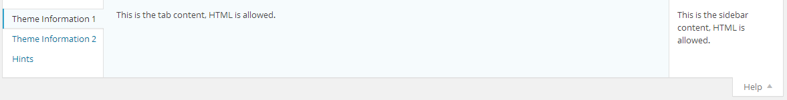

# Global Arguments Reference

Redux has a large amount of arguments. The framework instance itself has arguments, each field has its own arguments.

::: tip
For an example of how to set global arguments, see the [Redux API Redux::setArgs()](./redux-api.md#Redux::setArgs()) documentation.
:::

::: warning Global arguments in alphabetical order
[[toc]]
:::

## admin_bar
**Default**: `'admin_bar' => 'true'`

If set to true, the option panel will appear in the admin bar. Making it easy for your users to quickly get to your panel.

## admin_bar_icon
**Default**: `'admin_bar_icon' => 'dashicons-admin-generic'`

String value indicated which icon to use for the admin bar icon. Please refer to the [Dashicons Cheat Sheet](http://calebserna.com/dashicons-cheatsheet/) for a list of available icons.

## allow_sub_menu
**Default**: `'allow_sub_menu' => 'true'`

This is the variable that determines whether or not section labels are displayed below the admin menu.

## async_typography
**Default**: `'async_typography' => false`

This argument determines if Google fonts load on the front-end of a theme asynchronously . This should be considered experimental, as some issues have been known to crop up. Any issues should be reported to the [Redux Framework Github issues board](https://github.com/ReduxFramework/redux-framework/issues).

## cdn_check_time
**Default**: `'cdn_check_time' => 1440`

Time before Redux checks to see if the CDN is still accessible.

## class
**Default**: `'class' => ''`

This argument may be set to append any number of classes to the main Redux class attribute.

## customizer
**Default**: `'customizer' => 'true'`

This argument sets the flag to enable or disabled basic [WordPress customizer](http://en.support.wordpress.com/customizer/) support..

## customizer_only
**Default**: `'customizer_only' => 'false'`

This argument determines whether or not to hide the options panel (leaving options accessible only through the customizer). For developing themes specifically for wordpress.org, this argument will need to be set to 

## database
**Default**: `'database' => ''`

This argument sets the database mode for how Redux options are stored in the database. Currently, the only mode accepted is `network` for multi-site panel support! Otherwise, leave this argument blank for default functionality.

For normal operation, leave this argument blank, otherwise, choose from one of the following modes. Modes marked as experimental have not been fully tested and may not function properly:

- `network`: For multi-site support
- `transient`: (experimental) - Sets options as transients, and will expire in the time set via [transient_time](./global-arguments.md#transient-time) .
- `theme_mods`, `theme_mods_expanded` (both experimental) - Saves modifications for the current theme.

## default_mark
**Default**: `'default_mark' => ''`

This is the variable specifies the symbol to print by the field's title when the field  is set to the default value. [default_show](./global-arguments.md#default-mark) must be set to true. The `*` symbol is recommended.

## default_show
**Default**: `'default_show' => 'false'`

This is the variable that enabled or disables whether or not the field's default value is displayed next to the field's title.

## dev_mode
**Default**: `'dev_mode' => 'true'`

This is the variable that enables or disables Redux's developer mode. When developer mode is set to true, the load time is displayed at the bottom of the options panel. Also, Redux loads all field and core JavaScript in non minimzed form.

## disable_google_fonts_link
**Default**: `'disable_google_fonts_link' => false`

If set to true, the google fonts link output for typography will be enabled.

## disable_save_warn
**Default**: `'disable_save_warn' => false`

This argument determines if the 'save changes' notice appears at the top of the options panel when any changes are made.

## display_name
**Default**: `'display_name' => $theme->get('Name')`

This argument sets the title that appears at the top of the options panel.

## display_version
**Default**: `'display_version' => $theme->get('Version')`

This argument set the version number that appears after the title at the top of the options panel.

## footer_text
**Default**: `'footer_text' => '<p>This text is displayed below the options panel. It isn\'t required, but more info is always better! The footer_text field accepts all HTML.</p>'`

This argument set the text to be displayed at the bottom of the options panel, in the footer section. Use of HTML is permitted.

## global_variable
**Default**: `'global_variable' => ''`

This argument has two purposes:

* 1. Rename the global variable from the opt_name value.
* 2. Disable the global variable from being defined at all if the value is set to `false`.


## google_api_key
::: warning DEPRECATED
This argument has been deprecated in Redux 4.x
:::

**Default**: `'google_api_key' => ''`

This argument holder the key used to request Google WebFonts for the <a title="Typography" href="/redux-framework/fields/typography/">Typography</a> field. <del>Without this key, Google fonts will be omitted</del>. <strong>Now no longer required to make Google Fonts work!</strong>

A Google Developer API must be independently obtained. Redux does not supply this key on your behalf. For more information on obtaining your own key, please visit: <a href="https://developers.google.com/fonts/docs/developer_api">https://developers.google.com/fonts/docs/developer_api</a>

## google_update_weekly

::: warning DEPRECATED
This argument has been deprecated in Redux 4.x
:::

**Default**: `'google_update_weekly' => false`

This will only function if you have a google_api_key provided. This argument tells the core to grab the Google fonts cache weekly, ensuring your font list is always up to date.

## help_sidebar

<span style="display:block;text-align:center"></span>

**Default**: `'help_sidebar' => '<p>This is the sidebar content, HTML is allowed.</p>'`

This argument sets the text that appears on the left hand side of the help dropdown, at the top of the option panel page. HTML is permitted. Any text passed should be surrounded by the `<p>` paragraph tags.

**Example:**
```php
$content = __( '<p>This is the sidebar content, HTML is allowed.</p>', 'redux-framework-demo' );
Redux::set_help_sidebar( $opt_name, $content );
```

Alternatively you can set the global arg `help_sidebar` in this manner to produce the same result.

```php
$content = __( '<p>This is the sidebar content, HTML is allowed.</p>', 'redux-framework-demo' );
Redux::setArgs( $opt_name, array( 'help_sidebar' => $content ) );
```

::: warning Warning Redux 3.x Users
For function name changes, please refer the [Redux 4.x Migration](../guide/4x-migration.md) guide.
:::

## help_tabs
<span style="display:block;text-align:center"></span>

This argument sets the individual tabs in the help dropdown. HTML is permitted. Any text passed should be surrounded by the `<p></p>` paragraph tags.


|Name|Type|Description|
|--- |--- |--- |
|id|string|A unique ID representing the individual help tab.|
|title|string|Text representing the title of the help tab.|
|content|string|Text to display in the help tab content area. This string should be surrounded by `>p<` paragraph tags. HTML is permitted.|


**Example:**
```php
Redux::set_help_tab( $opt_name, array(
  array(
    'id'      => 'redux-help-tab-1',
    'title'   => __( 'Theme Information 1', 'redux-framework-demo' ),
    'content' => __( '<p>This is the tab content, HTML is allowed.</p>', 'redux-framework-demo' )
  ),
  array(
    'id'      => 'redux-help-tab-2',
    'title'   => __( 'Theme Information 2', 'redux-framework-demo' ),
    'content' => __( '<p>This is the tab content, HTML is allowed.</p>', 'redux-framework-demo' )
  )
) );
```

Alternatively you can set the global arg `help_tabs` in this manner to produce the same result.

```php
Redux::setArgs( $opt_name, array( 'help_tabs' => array(
  array(
    'id'      => 'redux-help-tab-1',
    'title'   => __( 'Theme Information 1', 'redux-framework-demo' ),
    'content' => __( '<p>This is the tab content, HTML is allowed.</p>', 'redux-framework-demo' )
  ),
  array(
    'id'      => 'redux-help-tab-2',
    'title'   => __( 'Theme Information 2', 'redux-framework-demo' ),
    'content' => __( '<p>This is the tab content, HTML is allowed.</p>', 'redux-framework-demo' )
  )
) );
```

::: warning Warning Redux 3.x Users
For function name changes, please refer the [Redux 4.x Migration](../guide/4x-migration.md) guide.
:::

## hide_expand
**Default**: `'hide_expand' => false`

This variable determines if the 'Expand Options' buttons is visible on the options panel.

## hide_reset
**Default**: `'hide_reset' => false`

This variable determines if the 'Reset All and 'Reset Section' buttons are visible on the options panel.

## hints
The [hints argument](./argument-hints.md) requires settings involving multiple arrays. Thus, an entire article has been devoted to its usage. REad more on [using Hints in fields](./argument-hints.md).

## intro_text
**Default**: `'intro_text' => '<p>This text is displayed above the options panel. It isn\'t required, but more info is always better! The intro_text field accepts all HTML.</p>'`

This variable sets the text that appears at the top of the options panel, but below the title. HTML is permitted.

## last_tab
**Default**: `'last_tab' => ''`

This variable sets forces the options panel to open at the specified tab number.

## menu_icon
**Default**: `'menu_icon' => ''`

This variable accepts a URL to a custom icon to be displayed in the primary menu icon.

## menu_type
**Default**: `'menu_type' => 'menu'`

This variable sets whether or not the admin menu is displayed. Accepts either `menu`, `submenu`, or `hidden`.

## menu_title
**Default**: `'menu_title' => 'Sample Options'`

This variable sets the text to display as the admin menu's label, and only when the admin menu is available.

## network_admin
**Default**: `'network_admin' => false`

This variable enables the network admin when using the `network` `<a href="/redux-framework/arguments/database" title="database">database</a>` mode.

## network_sites
**Default**: `'network_sites' => true`

This variable enables sites as well as admin when using the `network <a href="/redux-framework/arguments/database" title="database">database</a>` mode.

## open_expanded
**Default**: `'open_expanded' => false`

This variable determines if the options panel sidebar is to be displayed. This may be useful for an options panel with only one section.

## opt_name
**Default**: `'opt_name' => 'redux_demo'`

This is the variable where all option data is stored in the database. It also acts as the global variable in which data options are retrieved via code.

## output
**Default**: `'output' => 'true'`

This variable acts as a global shut-off for the framwork's dynamic CSS output. When set to false, Google fonts are also disabled.

## output_tag
**Default**: `'output_tag' => 'true'`

This variable sets whether or not dynamic CSS will be generated for the customizer and Google fonts. However, when set to false, dynamic CSS will no longer print to the page head.

## page_icon
**Default**: `'page_icon' => 'icon-themes'`

This variable sets the icon appearing in the admin panel, next to the menu title.

## page_parent
**Default**: `'page_parent' => 'themes.php'`

This variable sets where the options menu will be places on the WordPress admin sidebar. For a full list of options, visit: <a href="http://codex.wordpress.org/Function_Reference/add_submenu_page#Parameters">http://codex.wordpress.org/Function_Reference/add_submenu_page#Parameters</a>

## page_priority
**Default**: `'page_priority' => ''`

This variable accepts a number specifying where the menu will appear in the admin area.

## page_permissions
**Default**: `'page_permissions' => 'manage_options'`

This variable set the permission level required to access the options panel. For a complete list of roles and capabilities, please visit this page: [https://codex.wordpress.org/Roles_and_Capabilities](https://codex.wordpress.org/Roles_and_Capabilities)

## page_slug
**Default**: `'page_slug' => '_options'`

This variable set the page slug to denote the options panel. It's recommended to place a unique string (i.e. - theme name) before the value's underscore.

## page_title
**Default**: `'page_title' => 'Sample Options'`

This variable sets the title to be displayed on the panel page.

## save_defaults
**Default**: `'save_defaults' => 'true'`

This variable sets whether or not the default values are saved to the database on load, before Save Changes is clicked.

## settings_api
**Default**: `'settings_api' => 'true'`

Turns off the use of the settings API. Primarily useful for Customizer-Only instances.

## share_icons

The `share_icons` argument sets an array of social website icons at the bottom-left of the options panel, before the footer. Any icon or link may be used to indicate any social networking site. Each icon requires its own array block, as shown above.

|Name|Type|Description|
|--- |--- |--- |
|url|string|Full URL to your specific page of the chosen social networking site.|
|title|string|Title to display as the alt tag of the icon.|
|icon|string|Specific [Elusive Icon](http://shoestrap.org/downloads/elusive-icons-webfont/) to display.|
|img|string|Optional. Full URL to the icon to use in place of a font icon.|


```php
    $args['share_icons'][] = array(
        'url'   => 'http://twitter.com/reduxframework',
        'title' => 'Follow us on Twitter',
        'icon'  => 'el el-twitter'
    );
    $args['share_icons'][] = array(
        'url'   => 'http://www.linkedin.com/company/redux-framework',
        'title' => 'Find us on LinkedIn',
        'icon'  => 'el el-linkedin'
    );
``` 

## show_import_export
**Default**: `'show_import_export' => 'true'`

This variable sets whether or not Redux will display the Import/Export tab at the bottom of the options panel. Please note, if the Import / Export feature is used as a field, this tab will not display regard the the value set to it.

## system_info
**Default**: `'system_info' => false`

This variable determines if the Redux system info section is displayed. It's useful for debugging purposes, and is only available when `<a href="/redux-framework/arguments/dev_mode/" title="dev_mode">dev_mode</a>` is set to true.

Please note, when this option is active, it will slow down the panel loading time.

## transient_time
**Default**: `'transient_time' => 60 * MINUTE_IN_SECONDS`

This variable set the amount of time to assign to transient values used within Redux. This is an advanced option. If you do not understand what it does, please do not change it.

## update_notice
**Default**: `'update_notice' => 'true'`

::: warning DEPRECATED
This argument has been deprecated in Redux 4.x
:::

This variable sets whether or not Redux will display an admin notice when a new build is ready for download via [Github](https://github.com/ReduxFramework/redux-framework). This feature is only available when `dev_mode` is set to `true`.

## use_cdn
**Default**: `'use_cdn' => 'true'`

Tells Redux to use CDN for various JS libraries, or to use an embedded extension.

