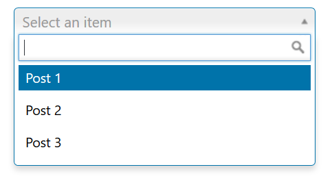
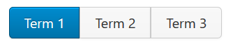

# Using the `data` Argument

The `data` argument allows Redux to populate the [field](../objects/field.md) using dynamic queries for things 
like posts, pages, menus, categories, terms, etc. It automatically uses the correct WordPress function to retrieve each 
type of data. Most types of data accept an 'args' value, which will be passed to the WordPress function to control 
what data is retrieved.

::: warning Table of Contents
[[toc]]
:::

## Built-in Values
|Data Key|Description|
|--- |--- |
|categories|Gets data using the WordPress [get_categories()](https://codex.wordpress.org/Function_Reference/get_categories) function.|
|menus|Gets data using the WordPress function [wp_get_nav_menus()](https://codex.wordpress.org/Function_Reference/wp_get_nav_menus).|
|pages|Gets data using the WordPress function [get_pages()](https://codex.wordpress.org/Function_Reference/get_pages). See [Using 'pages'](#using-pages) for additional details.|
|terms|Gets data using the WordPress function [get_terms()](https://codex.wordpress.org/Function_Reference/get_terms). See [Using 'terms'](#using-terms) for additional details.|
|taxonomies|Gets data using the WordPress function [get_taxonomies()](https://codex.wordpress.org/Function_Reference/get_taxonomies).|
|posts|Gets data using the WordPress function [get_posts()](https://codex.wordpress.org/Function_Reference/get_posts).|
|post_types|Gets data using the WordPress function [get_post_types()](https://codex.wordpress.org/Function_Reference/get_post_types).|
|tags|Gets data using the WordPress function [get_tags()](https://codex.wordpress.org/Function_Reference/get_tags).|
|image_sizes|Gets data from the `$_wp_registered_nav_menus` global array. **Does not support additional arguments**|
|menu_locations|Gets data from the `$_wp_additional_image_sizes` global array. **Does not support additional arguments**|
|elusive-icons|Gets a list of all the Elusive Icons.|
|roles|Gets all the `$wp_roles` global array. **Does not support additional arguments**|
|sidebars|Gets all the registered sidebars from `$wp_registered_sidebars` global array. **Does not support additional arguments**|
|capabilities|Gets all the roles in the `$wp_roles` global array. **Does not support additional arguments**|
|callback|Gets data by calling the function defined in `args` as a string. See [Using 'callback'](#using-a-custom-callback) for additional details.|
|users|Gets data using the [get_users()](https://codex.wordpress.org/Function_Reference/get_users) function.|


## Examples and Usage

#### Standard Select Using Posts

<span style="display:block;text-align:center"></span>

```php
$fields = array(
    'id'    => 'opt-select-post',
    'type'  => 'select',
    'title' => esc_html__( 'Select Post', 'your-textdomain-here' ), 
    'data'  => 'posts',
    'args'  => array(
        'post_type'      => 'post_type_name',
        'posts_per_page' => -1,
        'orderby'        => 'title',
        'order'          => 'ASC',
    )
);
```

#### Button Set Using Terms
<span style="display:block;text-align:center"></span>

```php
    $fields = array(
        'id'    => 'opt-button-set-term',
        'type'  => 'select',
        'title' => esc_html__( 'Select Term', 'your-textdomain-here' ), 
        'data'  => 'terms',
        'args'  => array(
            'taxonomies' => array( 'taxonomy_name' ),
            'hide_empty' => false,
        )
    );
```

### Example Usage
This example in based on the example usage provided above. Be sure to change `$redux_demo` to the value you specified in your [opt_name](../global_arguments.md#opt_name) argument.

```php
global $redux_demo;

echo 'Selected post: ' . $redux_demo['opt-select-post'];
echo 'Selected term: ' . $redux_demo['opt-button-set-term'];
```

### Using `terms`

```php
array(
    'data' => 'terms',
    'args' => array(
        'taxonomies' => array( 'taxonomy_name' ),
    )
)
```

### Using `pages`

The default results for the pages value returns only 20 items. If you wish to increase this limit, you can use the example
below. If you set the value to `-1` you'll get everything in the database. Warning, this can be quite detrimental to a 
website if there are a large number of posts.

```php
array(
    'data' => 'pages',
    'args' => array(
        'posts_per_page' => 30,
    ),
)
```

### Using a Custom `callback`

Sometimes you may need to fetch data in a different way than Redux has set up. In that case, you can use a custom callback
function.

```php
array(
    'data' => 'callback',
    'args' => 'my_callback_function'
)
```

::: tip
The callback function should return an array. The keys will be saved, and the values displayed.

```php
function my_callback_function() {
	return array(
		'here' => 'Here I am',
		'rocking' => 'Rocking like a hurricane',
	);
}
```
:::


