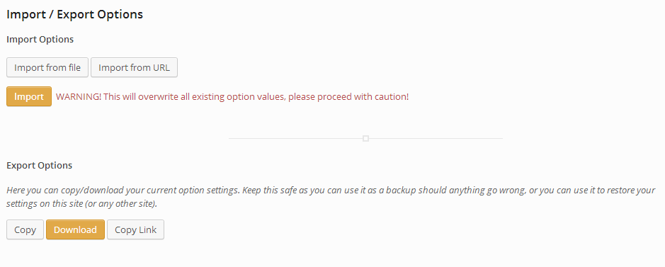

# Import/Export

The Import/Export extension offers users the ability to back up and restore their Redux options data in one of three ways:  raw data, file and URL.

<span style="display:block;text-align:center"></span>

## Arguments
|Name|Type|Default|Description|
|--- |--- |--- |--- |
|type|string|`import_export`|Value identifying the field type.|
|id|string|Unique ID identifying the field. Must be different from all other field IDs.|
|title|string|Displays title of the option.|
|subtitle|string|Subtitle display of the option, situated beneath the title.|
|desc|string|Description of the option, appearing beneath the field control.|
|class|string|Appends any number of classes to the field's class attribute.|
|permissions|string|String specifying the capability required to view the section.   More info.|
|full_width|bool|Sets whether or not the field is set full width or as a section, similar to the other fields.|


## Example Declaration
```php
array(
    'id'            => 'opt-import-export',
    'type'          => 'import_export',
    'title'         => 'Import Export',
    'subtitle'      => 'Save and restore your Redux options',
    'full_width'    => false,
)
```
