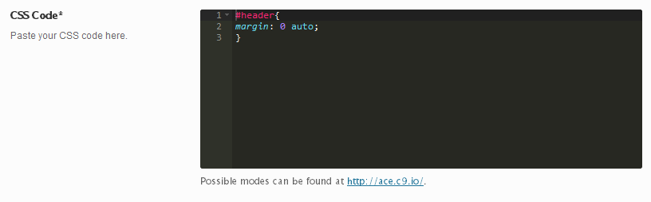

# ACE Editor

The ACE Editor field offers the ability to edit back-end code in an easy to use and easy to read embedded interface.  In addition to matching the features of native code editors such as <a href="http://www.google.com/url?sa=t&amp;rct=j&amp;q=&amp;esrc=s&amp;source=web&amp;cd=1&amp;cad=rja&amp;uact=8&amp;ved=0CCUQFjAA&amp;url=http%3A%2F%2Fwww.sublimetext.com%2F&amp;ei=5MAfU9vSOs_KkQfUnIGwBw&amp;usg=AFQjCNHeDtH9qLiUebuy99ldU-zJxasqGg&amp;sig2=4OIraSkZYw0uYuZZ1U1pVQ&amp;bvm=bv.62788935,d.eW0" target="_blank">Sublime</a>, <a href="http://www.vim.org/" target="_blank">Vim </a>and <a href="http://macromates.com/" target="_blank">TextMate</a>, ACE offers real-time checking for code accuracy.

<span style="display:block;text-align:center"></span>

::: warning Table of Contents
[[toc]]
:::

## Arguments
Array containing the `content` and optional `title` arguments for the hint tooltip.  <a class="more_info" title="Using Hints in Fields" href="/redux-framework/the-basics/using-hints-in-fields/"><i class="el-icon-circle-arrow-right"></i> More info.</a>

|Name|Type|Default|Description|
|--- |--- |--- |--- |
|type|string|`ace_editor`|Value identifying the field type.|
|id|string||Unique ID identifying the field.  Must be different from all other field IDs.|
|title|string||Display title of the option.|
|subtitle|string||Subtitle display of the option, situated beneath the title.|
|desc|string||Description of the option, appearing beneath the field control.|
|class|string||Appends any number of classes to the field's class attribute.|
|compiler|bool||Flag to set the compiler hook, or array of CSS selectors which passes dynamic CSS to the compiler hook.   More info.|
|required|array||Array of three values: Parent field ID, comparison operator, and value which affects the field's visibility.   More info.|
|permissions|string||String specifying the capability required to view the section.   More info.|
|default|string||Default text to be displayed in the editor.|
|mode|string|`javascript`|Sets the language mode of the editor.  Accepts:  `css` `html` `javascript ` `json` `less` `markdown` `mysql` `php` `plain_text` `sass` `scss` `text` `xml`|
|theme|string|`monokai`|Sets the theme of the editor.  Accepts: `chrome` or `monokai`|
|options|array|array(<br/>'&nbsp;&nbsp;minLines'=> 12, <br/>&nbsp;&nbsp;'maxLines'=> 30<br/>)|Pass any option to the Ace Editor object. For more details visit: http://ace.c9.io/ and the Configuring Ace Wiki.|

::: tip Also See
- [Using the `compiler` Arguments`](../guide/the-compiler-argument.md)
- [Using the `hints` Argument](../guide/the-hints-argument.md)
- [Using the `permissions` Argument](../guide/the-permissions-argument.md)
- [Using the `required` Argument](../guide/using-the-required-argument.md)
:::

## Example Declaration

```php
$fields = array(
    'id'       => 'css_editor',
    'type'     => 'ace_editor',
    'title'    => __('CSS Code', 'redux-framework-demo'),
    'subtitle' => __('Paste your CSS code here.', 'redux-framework-demo'),
    'mode'     => 'css',
    'theme'    => 'monokai',
    'desc'     => 'Possible modes can be found at http://ace.c9.io/.',
    'default'  => "#header{\nmargin: 0 auto;\n}"
);
```

## Example Usage
This example in based on the example usage provided above. Be sure to change `$redux_demo` to the value you specified in your <a title="opt_name" href="/redux-framework/arguments/opt_name/">`opt_name` argument.</a>

```php
global $redux_demo;

echo 'ACE Editor output: ' . $redux_demo['css-editor'];
```
