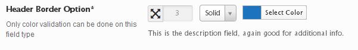

# Border

The Border field is a great way to set the border properties of any HTML object that supports the border property.

<span style="display:block;text-align:center"></span>

::: warning Table of Contents
[[toc]]
:::

## Arguments
|Name|Type|Default|Description|
|--- |--- |--- |--- |
|type|string|`border`|Value identifying the field type.|
|id|string||Unique ID identifying the field. Must be different from all other field IDs.|
|title|string||Displays title of the option.|
|subtitle|string||Subtitle display of the option, situated beneath the title.|
|desc|string||Description of the option, appearing beneath the field control.|
|class|string||Appends any number of classes to the field's class attribute.|
|compiler|bool/array||Flag to run the compiler hook or array of CSS selectors to pass dynamic CSS to the compiler hook.  More info|
|output|array||Array of CSS selectors to dynamically generate CSS.  More info|
|required|array||Provide the parent, comparison operator, and value which affects the field's visibility.  More info|
|default|array||Array of default values. See 'Default Options' below.|
|permissions|string||String specifying the capability required to view the section.   More info.|
|select2|array||Array of select2 arguments. For more information see the 'Constructor' section of the Select2 docs.|
|hint|array||Array containing the `content` and optional `title` arguments for the hint tooltip. More info|
|validate|string|`color`|String value `color` to validate the color selection.  It is the only accepted value for this field.|
|all|bool|true|Flag to enable all borders using one value.|
|left|bool|true|Flag to enable the left field border input.|
|right|bool|true|Flag to enable the right field border input.|
|top|bool|true|Flag to enable the top field border input.|
|bottom|bool|true|Flag to enable the bottom field border input.|
|style|bool|true|Flag to enable the style selector.|
|color|bool|true|Flag to enable the color picker.|

::: tip Also See
- [Using the `compiler` Argument](../configuration/argument-compiler.md)
- [Using the `hints` Argument](../configuration/argument-hints.md)
- [Using the `output` Argument](../guide/the-output-argument.md)
- [Using the `permissions` Argument](../configuration/argument-permissions.md)
- [Using the `required` Argument](../configuration/argument-required.md)
:::

## Default Options
|Name|Type|Description|
|--- |--- |--- |
|border-color|string|Hex string representing the default color.|
|border-style|string|Sets the default CSS border.  Accepts: `solid` `dotted` `dashed` or `none`.|
|border-top|string|Sets the default value of the top border.|
|border-right|string|Sets the default value of the right border.|
|border-bottom|string|Sets the default value of the bottom border.|
|border-left|string|Sets the default value of the left border.|
|border-width|string|Sets the default value of the border's width.|


Note:  It is only necessary to set the `border-width` default when the `all` argument is set to true.

## Example Declaration
```php
$fields = array( 
    'id'       => 'header-border',
    'type'     => 'border',
    'title'    => __('Header Border Option', 'redux-framework-demo'),
    'subtitle' => __('Only color validation can be done on this field type', 'redux-framework-demo'),
    'output'   => array('.site-header'),
    'desc'     => __('This is the description field, again good for additional info.', 'redux-framework-demo'),
    'default'  => array(
        'border-color'  => '#1e73be', 
        'border-style'  => 'solid', 
        'border-top'    => '3px', 
        'border-right'  => '3px', 
        'border-bottom' => '3px', 
        'border-left'   => '3px'
    )
);
```

## Example Usage
This example in based on the example usage provided above. Be sure to change `$redux_demo` to the value you specified in your <a title="opt_name" href="/redux-framework/arguments/opt_name/">`opt_name` argument.</a>

```php
global $redux_demo;

echo 'Border top: '    . $redux_demo['header-border']['border-top'];
echo 'Border bottom: ' . $redux_demo['header-border']['border-bottom'];
echo 'Border left: '   . $redux_demo['header-border']['border-left'];
echo 'Border right: '  . $redux_demo['header-border']['border-right'];
echo 'Border style: '  . $redux_demo['header-border']['border-style'];
echo 'Border color: '  . $redux_demo['header-border']['border-color'];
```

