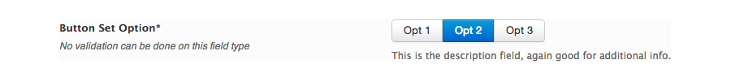

# Button Set

The button set gives you a button bar to set options. It can be useful when you want to group a number of options together in a more advanced radio or checkbox (multi argument, see blow).

<span style="display:block;text-align:center"></span>

::: warning Table of Contents
[[toc]]
:::

## Arguments
|Name|Type|Default|Description|
|--- |--- |--- |--- |
|type|string|`button_set`|Value identifying the field type.|
|id|string||Unique ID identifying the field.  Must be different from all other field IDs.|
|title|string||Displays title of the option.|
|subtitle|string||Subtitle display of the option, situated beneath the title.|
|desc|string||Description of the option, appearing beneath the field control.|
|class|string||Appends any number of classes to the field's class attribute.|
|compiler|bool||Flag to run the compiler hook.   More info|
|required|array||Provide the parent, comparison operator, and value which affects the field's visibility.  More info|
|options|array||Array of key pairs representing the individual ticks.|
|default|vari||String/int or array value representing the default.  See 'Default Option' below.|
|permissions|string||String specifying the capability required to view the section.   More info.|
|hint|array||Array containing the `content` and optional `title` arguments for the hint tooltip.  More info|
|multi|bool|false|Flag to set the field to multi-select.|

::: tip Also See
- [Using the `compiler` Argument](../configuration/argument-compiler.md)
- [Using the `hints` Argument](../configuration/argument-hints.md)
- [Using the `output` Argument](../guide/the-output-argument.md)
- [Using the `permissions` Argument](../configuration/argument-permissions.md)
- [Using the `required` Argument](../configuration/argument-required.md)
:::

## Default Option
The value of the default option will depend on whether or not the `multi` argument is set to true.  By default, the `multi` argument is set to false.  In this case, the `default` argument accepts a string or int value representing the key value from the `options` argument to set as selected.  When `multi` is set to true, the `default` argument accepts an array of values representing the key of the option from `options` to set as selected.

## Example Declaration
#### Single select

```php
Redux::addField( 'OPT_NAME', 'SECTION_ID', array(
    'id'       => 'button-set-single',
    'type'     => 'button_set',
    'title'    => __('Button Set, Single', 'redux-framework-demo'),
    'subtitle' => __('No validation can be done on this field type', 'redux-framework-demo'),
    'desc'     => __('This is the description field, again good for additional info.', 'redux-framework-demo'),
    //Must provide key => value pairs for options
    'options' => array(
        '1' => 'Opt 1', 
        '2' => 'Opt 2', 
        '3' => 'Opt 3'
     ), 
    'default' => '2'
) );
```

#### Multi select
```php
Redux::addField( 'OPT_NAME', 'SECTION_ID', array(
    'id'       => 'button-set-multi',
    'type'     => 'button_set',
    'title'    => __('Button Set, Single', 'redux-framework-demo'),
    'subtitle' => __('No validation can be done on this field type', 'redux-framework-demo'),
    'desc'     => __('This is the description field, again good for additional info.', 'redux-framework-demo'),
    'multi'    => true,
    //Must provide key => value pairs for options
    'options' => array(
        '1' => 'Opt 1', 
        '2' => 'Opt 2', 
        '3' => 'Opt 3'
     ), 
    'default' => array('2', '3'),
) );
```

## Example Usage
This example in based on the example usage provided above. Be sure to change `$redux_demo` to the value you specified in your <a title="opt_name" href="/redux-framework/arguments/opt_name/">`opt_name` argument.</a>

#### Single
```php
global $redux_demo;
echo $redux_demo['button-set-single'];
```

#### Multi
```php
global $redux_demo;

if (!empty) {
    foreach ($redux_demo['button-set-multi'] as $key => $value) {
        echo $value;
    }
}
```

::: warning
Due to the way in which data is saved to the database, it is strongly recommended to perform a PHP empty() and/or is_array() check when retrieving the data from this field via a foreach() loop.
:::


