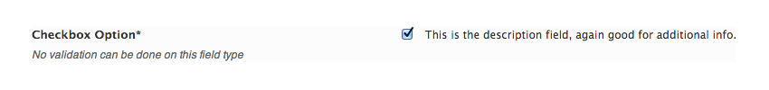

# Checkbox

The Checkbox field may be used to offer a single check option, or a group of multi-check options.

<span style="display:block;text-align:center"></span>

::: warning Table of Contents
[[toc]]
:::

## Arguments
|Name|Type|<div style="width:85px;">Default</div>|Description|
|--- |--- |--- |--- |
|type|string|`checkbox`|Value identifying the field type.|
|options|array||Array of key pair values representing the individual check boxes.  They key represents the ID of the checkbox, the value is the text displayed next to the checkbox.|
|default|string/int/array||See [Default Argument](#default-argument) below.|

::: tip Also See
- [Global Field Arguments](../configuration/fields/arguments.md)
- [Using the `compiler` Argument](../configuration/fields/compiler.md)
- [Using the `data` Argument](../configuration/fields/data.md)
- [Using the `permissions` Argument](../configuration/fields/permissions.md)
- [Using the `required` Argument](../configuration/fields/required.md)
:::

## Default Argument

When using a single checkbox, the `default` argument accepts a string/int/bool representing with 0/false or 1/true.  When using multi-checkbox, the `default` argument accepts an array of key pair values.  They key represents the id of the checkbox, the value either a 0/false or 1/true value.


## Generate a Declaration
<script>
import builder from './checkbox.json';
export default {
    data () {
        return {
            builder: builder,
            defaults: {}
        };
    }
}
</script>
<builder :builder_json="builder" :builder_defaults="defaults" />


## Example Declaration
#### Single Checkbox
```php
Redux::addField( 'OPT_NAME', 'SECTION_ID', array(
    'id'       => 'opt_checkbox',
    'type'     => 'checkbox',
    'title'    => __('Checkbox Option', 'redux-framework-demo'), 
    'subtitle' => __('No validation can be done on this field type', 'redux-framework-demo'),
    'desc'     => __('This is the description field, again good for additional info.', 'redux-framework-demo'),
    'default'  => '1'// 1 = on | 0 = off
) );
```

#### Multi Checkbox
```php
Redux::addField( 'OPT_NAME', 'SECTION_ID', array(
    'id'       => 'opt_multi_checkbox',
    'type'     => 'checkbox',
    'title'    => __('Multi Checkbox Option', 'redux-framework-demo'), 
    'subtitle' => __('No validation can be done on this field type', 'redux-framework-demo'),
    'desc'     => __('This is the description field, again good for additional info.', 'redux-framework-demo'),

    //Must provide key => value pairs for multi checkbox options
    'options'  => array(
        '1' => 'Opt 1',
        '2' => 'Opt 2',
        '3' => 'Opt 3'
    ),

    //See how default has changed? you also don't need to specify opts that are 0.
    'default' => array(
        '1' => '1', 
        '2' => '0', 
        '3' => '0'
    )
) );
```


## Example Usage
This example in based on the example usage provided above. Be sure to change `$redux_demo` to the value you specified in your [opt_name](../configuration/global_arguments.md#opt_name) argument.

#### Single checkbox
```php
$global $redux_demo;

echo 'Checkbox value: ' . $redux_demo['opt_checkbox'];
```

#### Multi checkbox
```php
$global $redux_demo;

echo 'First checkbox value: '  . $redux_demo['opt_checkbox']['1'];
echo 'Second checkbox value: ' . $redux_demo['opt_checkbox']['2'];
echo 'Third checkbox value: '  . $redux_demo['opt_checkbox']['3'];

```