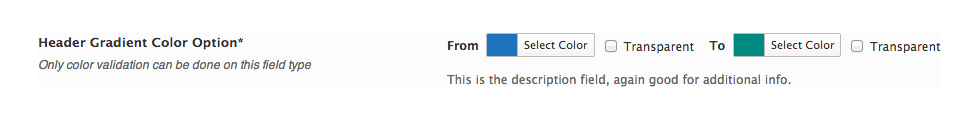

# Color Gradient

The Color Gradient controls allows for the selection of two separate colors, for use in any situation that requires gradient colors (i.e. Header, footer, sidebar, etc...).

<span style="display:block;text-align:center"></span>

::: warning Table of Contents
[[toc]]
:::

## Arguments
|Name|Type|Default|Description|
|--- |--- |--- |--- |
|type|string|`color_gradient`|Value identifying the field type.|
|default|string||See [Default Argument](#default-argument) below.|
|validate|string||The only accepted validation type is `color`.|
|transparent|bool|`true`|Flag to set the visibility of the transparency checkbox.|

::: tip Also See
- [Global Field Arguments](../configuration/fields/arguments.md)
- [Using the `compiler` Argument](../configuration/fields/compiler.md)
- [Using the `output` Argument](../configuration/fields/output.md)
- [Using the `required` Argument](../configuration/fields/required.md)
:::

## Default Argument
|Name|Type|Description|
|--- |--- |--- |
|to|string|Hex string value for the left gradient color.|
|from|string|Hex string value for the right gradient color.|

::: warning Transparency
To set the transparency checkbox by default, use the string `transparent` in place of a string hex value in either the `to` or `from` argument.
:::


## Example Declaration
<script>
import builder from './color-gradient.json';
export default {
    data () {
        return {
            builder: builder,
            defaults: {
                'color'       : '#333', 
                'font-style'  : '700', 
                'font-family' : 'Abel', 
                'google'      : true,
                'font-size'   : '33px', 
                'line-height' : '40'
            }
        };
    }
}
</script>
<builder :builder_json="builder" :builder_defaults="defaults" />


## Example Declaration
```php
Redux::addField( 'OPT_NAME', 'SECTION_ID', array(
    'id'       => 'opt-color-gradient',
    'type'     => 'color_gradient',
    'title'    => __('Header Gradient Color Option', 'redux-framework-demo'),
    'subtitle' => __('Only color validation can be done on this field type', 'redux-framework-demo'),
    'desc'     => __('This is the description field, again good for additional info.', 'redux-framework-demo'),
    'validate' => 'color',
    'default'  => array(
        'from' => '#1e73be',
        'to'   => '#00897e', 
    ),
) );
```

## Example Usage
This example in based on the example usage provided above. Be sure to change `$redux_demo` to the value you specified in your [opt_name](../configuration/global_arguments.md#opt_name) argument.

```php
global $redux_demo;

echo 'From color: ' . $redux_demo['opt-color-gradient']['from'];
echo 'To color: '   . $redux_demo['opt-color-gradient']['to'];
```