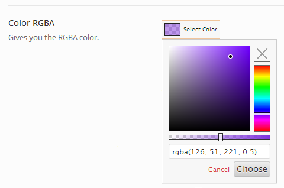

# Color RGBA

The Color RGBA field offers the addition of an alpha channel, initial color selection, saved colors and color palette to the color picker, allowing for not only opacity within the selected color, but an array of useful options for your end users.

<span style="display:block;text-align:center"></span>

This field makes use of Brian Grinstead's [Spectrum "No hassle jQuery color picker"](https://bgrins.github.io/spectrum/).

::: warning Table of Contents
[[toc]]
:::

## Arguments
|Name|Type|Default|Description|
|--- |--- |--- |--- |
|type|string|`color_rgba`|Value identifying the field type.|
|options|array||Array of options that sets the behavior of the color picker. See 'Color Picker Options' below.|
|default|array||See [Default Argument](#default-argument) below.|

::: tip Also See
- [Global Field Arguments](../configuration/fields/arguments.md)
- [Using the `compiler` Argument](../configuration/fields/compiler.md)
- [Using the `output` Argument](../configuration/fields/output.md)
- [Using the `output_variables` Argument](../configuration/fields/output-variables.md)
- [Using the `permissions` Argument](../configuration/fields/permissions.md)
- [Using the `required` Argument](../configuration/fields/required.md)
:::

## Color Picker Options
|Name|Type|Default|Description|
|--- |--- |--- |--- |
|input_text|string|`Select Color`|String specifying the button caption.|
|show_input|bool|`true`|Flag to allow free form typing input.|
|show_initial|bool|`true`|Flag to set the display of the color initially set when opening the color picker.|
|show_alpha|bool|`true`|Flag to set the alpha transparency selector.|
|show_palette|bool|`true`|Flag to set the display of the color picker's color palette.|
|show_palette_only|bool|`false`|Flag to display the color palette only, and nothing else.|
|show_selection_palette|bool|`true`|Flag to display a palette of previously selected colors.|
|max_palette_size|int|10|Integer value setting the number of colors to display horizontally in the color palette.|
|allow_empty|bool|`true`|Flag to set the display of of 'clear' button, removing the color value.|
|clickout_fires_change|bool|`false`|Flag that determines if clicking outside the color picker forces a color change.|
|choose_text|string|`Choose`|String to display for the color picker Choose button.|
|cancel_text|string|`Cancel`|String to display for the color picker Cancel button.|
|show_buttons|bool|`true`|Flag that sets the display of the Choose and Cancel buttons.|
|palette|array||Individual arrays color values. See 'Color Palettes' below.|


## Default Argument
The default argument requires an array with two key/pair values: `color` and `alpha`.

|Name|Type|Default|Description|
|--- |--- |--- |--- |
|color|string||Hex string of the default color value.|
|alpha|float/int|1|Integer or float value of the default alpha level.|


## Example Declaration
<script>
import builder from './color-rgba.json';
export default {
    data () {
        return {
            builder: builder,
            defaults: {
                'color'       : '#333', 
                'font-style'  : '700', 
                'font-family' : 'Abel', 
                'google'      : true,
                'font-size'   : '33px', 
                'line-height' : '40'
            }
        };
    }
}
</script>
<builder :builder_json="builder" :builder_defaults="defaults" />

## Example Declaration

```php
Redux::addField( 'OPT_NAME', 'SECTION_ID', array(
    'id'        => 'opt-color-rgba',
    'type'      => 'color_rgba',
    'title'     => 'RGBA Color Picker',
    'subtitle'  => 'Set color and alpha channel',
    'desc'      => 'The caption of this button may be changed to whatever you like!',

    // See Notes below about these lines.
    //'output'    => array('background-color' => '.site-header'),
    //'compiler'  => array('color' => '.site-header, .site-footer', 'background-color' => '.nav-bar'),
    'default'   => array(
        'color'     => '#fdfdfd',
        'alpha'     => 1
    ),

    // These options display a fully functional color palette.  Omit this argument
    // for the minimal color picker, and change as desired.
    'options'       => array(
        'show_input'                => true,
        'show_initial'              => true,
        'show_alpha'                => true,
        'show_palette'              => true,
        'show_palette_only'         => false,
        'show_selection_palette'    => true,
        'max_palette_size'          => 10,
        'allow_empty'               => true,
        'clickout_fires_change'     => false,
        'choose_text'               => 'Choose',
        'cancel_text'               => 'Cancel',
        'show_buttons'              => true,
        'use_extended_classes'      => true,
        'palette'                   => null,  // show default
        'input_text'                => 'Select Color'
    ),                        
) );

```

::: tip
Different elements (or modes) may be specified in the output and compiler arguments as key/pair values. For example, suppose you want to output a color as a background-color, instead of color. The following output array in key/pair format would accomplish this:
```php
'output' => array('background-color' => '.site-header')
```
:::

Alternatively, multiple elements could be specified for different selectors.

```php
'output' => array(
    'background-color' => '.site-header',
    'color'            => '.site-footer'
)
```

Multiple selectors are also supported. Separate them with commas.

```php
'output' => array('background-color' => '.site-header, .site-footer')
```

## Example Usage
Using the example above, outputting the the color would go as follows (Please remember to replace `redux_demo` with your own [opt_name](../configuration/global_arguments.md#opt_name) argument):

```php
global $redux_demo;

echo 'color: ' . $redux_demo['opt-color-rgba']['color'];
echo 'alpha: ' . $redux_demo['opt-color-rgba']['alpha'];
echo 'rgba: '  . $redux_demo['opt-color-rgba']['rgba'];

// Outputs:
// color: #fdfdfd
// alpha: 1
// rgba: rgba(253, 253, 253, 1)
```

## Color Palettes
Creating a custom palette for use within with color picker popup (container) requires setting a series of color arrays with string hex values within a single array. The color_rgba field comes pre-programmed with the following palette.

```php
'palette' => array(
    array("#000000", "#434343", "#666666", "#999999", "#b7b7b7", "#cccccc", "#d9d9d9", "#efefef", "#f3f3f3", "#ffffff"),
    array("#980000", "#ff0000", "#ff9900", "#ffff00", "#00ff00", "#00ffff", "#4a86e8", "#0000ff", "#9900ff", "#ff00ff"),
    array("#e6b8af", "#f4cccc", "#fce5cd", "#fff2cc", "#d9ead3", "#d9ead3", "#c9daf8", "#cfe2f3", "#d9d2e9", "#ead1dc"),
    array("#dd7e6b", "#ea9999", "#f9cb9c", "#ffe599", "#b6d7a8", "#a2c4c9", "#a4c2f4", "#9fc5e8", "#b4a7d6", "#d5a6bd"),
    array("#cc4125", "#e06666", "#f6b26b", "#ffd966", "#93c47d", "#76a5af", "#6d9eeb", "#6fa8dc", "#8e7cc3", "#c27ba0"),
    array("#a61c00", "#cc0000", "#e69138", "#f1c232", "#6aa84f", "#45818e", "#3c78d8", "#3d85c6", "#674ea7", "#a64d79"),
    array("#85200c", "#990000", "#b45f06", "#bf9000", "#38761d", "#134f5c", "#1155cc", "#0b5394", "#351c75", "#741b47"),
    array("#5b0f00", "#660000", "#783f04", "#7f6000", "#274e13", "#0c343d", "#1c4587", "#073763", "#20124d", "#4c1130")
);
```

Here are some other example palettes to experiment with:

#### GMail style

```php
'palette' => array(
    array("#000","#444","#666","#999","#ccc","#eee","#f3f3f3","#fff"),
    array("#f00","#f90","#ff0","#0f0","#0ff","#00f","#90f","#f0f"),
    array("#f4cccc","#fce5cd","#fff2cc","#d9ead3","#d0e0e3","#cfe2f3","#d9d2e9","#ead1dc"),
    array("#ea9999","#f9cb9c","#ffe599","#b6d7a8","#a2c4c9","#9fc5e8","#b4a7d6","#d5a6bd"),
    array("#e06666","#f6b26b","#ffd966","#93c47d","#76a5af","#6fa8dc","#8e7cc3","#c27ba0"),
    array("#c00","#e69138","#f1c232","#6aa84f","#45818e","#3d85c6","#674ea7","#a64d79"),
    array("#900","#b45f06","#bf9000","#38761d","#134f5c","#0b5394","#351c75","#741b47"),
    array("#600","#783f04","#7f6000","#274e13","#0c343d","#073763","#20124d","#4c1130"),
);
```

#### Snag-It Style

```php
'palette' => array(
    array("#ffffff", "#000000", "#c00000", "#f79646", "#f5f445", "#7fd13b", "#4bacc6", "#1f497d", "#8064a2", "#ff0000"),
    array("#f2f2f2", "#7f7f7f", "#f8d1d3", "#fdeada", "#fafdd7", "#e5f5d7", "#dbeef3", "#c6d9f0", "#e5e0ec", "#ffcc00"),
    array("#d7d7d7", "#595959", "#f2a3a7", "#fbd5b5", "#fbfaae", "#cbecb0", "#b7dde8", "#8db3e2", "#ccc1d9", "#ffff00"),
    array("#bebebe", "#414141", "#eb757b", "#fac08f", "#eef98e", "#b2e389", "#92cddc", "#548dd4", "#b2a2c7", "#00ff00"),
    array("#a3a3a3", "#2a2a2a", "#a3171e", "#e36c09", "#dede07", "#5ea226", "#31859b", "#17365d", "#5f497a", "#0000ff"),
    array("#7e7e7e", "#141414", "#6d0f14", "#974806", "#c0c00d", "#3f6c19", "#205867", "#0f243e", "#3f3151", "#9900ff")
);
```

#### Newton Style

```php
'palette' => array(
"#ffffff", "#000000", "#ff0000", "#ff8000", "#ffff00", "#008000", "#0000ff", "#4b0082", "#9400d3"
);
```

#### AOL Style

```php
'palette' => array(
    array("#ffffff", "#fff7de", "#ffffce", "#ffffbd", "#ffffd6", "#b5ff84", "#c6efde", "#efffff", "#efe7f7", "#dea5d6");
    array("#ded6c6", "#ffc6bd", "#ffe7b5", "#ffe7a5", "#efef7b", "#adf77b", "#5abd9c", "#a5d6f7", "#8494e7", "#ef7be7");
    array("#cec6b5", "#e78473", "#efad52", "#f7b500", "#efef9c", "#a5ff00", "#7bd6bd", "#a5d6de", "#8c5ae7", "#de6bce");
    array("#8c8473", "#ef0018", "#ef4210", "#f79400", "#ffff00", "#63d600", "#a5c684", "#5a63d6", "#7b52c6", "#c642ce");
    array("#736b63", "#d60039", "#d67310", "#f7844a", "#f7de00", "#429400", "#4a944a", "#4200ff", "#9c00de", "#a500c6");
    array("#39524a", "#b51821", "#944a08", "#a55229", "#8c8c00", "#318c00", "#429484", "#3100c6", "#523984", "#940084");
    array("#000000", "#940008", "#840008", "#ad2929", "#637321", "#296b00", "#29006b", "#21007b", "#52007b", "#84007b");
);
```

#### Old GMail Style

```php
'palette' => array(
    array("#ffffff", "#cecece", "#c6c6c6", "#9c9c9c", "#636363", "#313131", "#000000"),
    array("#ffcece", "#ff6363", "#ff0000", "#ce0000", "#9c0000", "#630000", "#310000"),
    array("#ffce9c", "#ff9c63", "#ff9c00", "#ff6300", "#ce6300", "#9c3100", "#633100"),
    array("#ffff9c", "#ffff63", "#ffce63", "#ffce31", "#ce9c31", "#9c6331", "#633131"),
    array("#ffffce", "#ffff31", "#ffff00", "#ffce00", "#9c9c00", "#636300", "#313100"),
    array("#9cff9c", "#63ff9c", "#31ff31", "#31ce00", "#009c00", "#006300", "#003100"),
    array("#9cffff", "#31ffff", "#63cece", "#00cece", "#319c9c", "#316363", "#003131"),
    array("#ceffff", "#63ffff", "#31ceff", "#3163ff", "#3131ff", "#00009c", "#000063"),
    array("#ceceff", "#9c9cff", "#6363ce", "#6331ff", "#6300ce", "#31319c", "#31009c"),
    array("#ffceff", "#ff9cff", "#ce63ce", "#ce31ce", "#9c319c", "#633163", "#310031"),
);
```

#### Hotmail Style

```php
'palette' => array(
    array("#ffffff", "#000000", "#efefe7", "#184a7b", "#4a84bd", "#c6524a", "#9cbd5a", "#8463a5", "#4aadc6", "#f79442"),
    array("#f7f7f7", "#7b7b7b", "#dedec6", "#c6def7", "#dee7f7", "#f7dede", "#eff7de", "#e7e7ef", "#deeff7", "#ffefde"),
    array("#dedede", "#5a5a5a", "#c6bd94", "#8cb5e7", "#bdcee7", "#e7bdb5", "#d6e7bd", "#cec6de", "#b5deef", "#ffd6b5"),
    array("#bdbdbd", "#393939", "#948c52", "#528cd6", "#94b5d6", "#de9494", "#c6d69c", "#b5a5c6", "#94cede", "#ffc68c"),
    array("#a5a5a5", "#212121", "#4a4229", "#10315a", "#316394", "#943131", "#739439", "#5a4a7b", "#31849c", "#e76b08"),
    array("#848484", "#080808", "#181810", "#082139", "#214263", "#632121", "#4a6329", "#393152", "#215a63", "#944a00"),
    array("#c60000", "#ff0000", "#ffc600", "#ffff00", "#94d652", "#00b552", "#00b5f7", "#0073c6", "#002163", "#7331a5"),
);
```

#### Yahoo Style

```php
'palette' => array(
    array("#000000", "#111111", "#2d2d2d", "#434343", "#5b5b5b", "#737373", "#8b8b8b", "#a2a2a2", "#b9b9b9", "#d0d0d0", "#e6e6e6", "#ffffff"),
    array("#7f7f00", "#bfbf00", "#ffff00", "#ffff40", "#ffff80", "#ffffbf", "#525330", "#898a49", "#aea945", "#c3be71", "#e0dcaa", "#fcfae1"),
    array("#407f00", "#60bf00", "#80ff00", "#a0ff40", "#c0ff80", "#dfffbf", "#3b5738", "#668f5a", "#7f9757", "#8a9b55", "#b7c296", "#e6ebd5"),
    array("#007f40", "#00bf60", "#00ff80", "#40ffa0", "#80ffc0", "#bfffdf", "#033d21", "#438059", "#7fa37c", "#8dae94", "#acc6b5", "#ddebe2"),
    array("#007f7f", "#00bfbf", "#00ffff", "#40ffff", "#80ffff", "#bfffff", "#033d3d", "#347d7e", "#609a9f", "#96bdc4", "#b5d1d7", "#e2f1f4"),
    array("#00407f", "#0060bf", "#0080ff", "#40a0ff", "#80c0ff", "#bfdfff", "#1b2c48", "#385376", "#57708f", "#7792ac", "#a8bed1", "#deebf6"),
    array("#00007f", "#0000bf", "#0000ff", "#4040ff", "#8080ff", "#bfbfff", "#212143", "#373e68", "#444f75", "#585e82", "#8687a4", "#d2d1e1"),
    array("#40007f", "#6000bf", "#8000ff", "#a040ff", "#c080ff", "#dfbfff", "#302449", "#54466f", "#655a7f", "#726284", "#9e8fa9", "#dcd1df"),
    array("#7f007f", "#bf00bf", "#ff00ff", "#ff40ff", "#ff80ff", "#ffbfff", "#4a234a", "#794a72", "#936386", "#9d7292", "#c0a0b6", "#ecdae5"),
    array("#7f003f", "#bf005f", "#ff007f", "#ff409f", "#ff80bf", "#ffbfdf", "#451528", "#823857", "#a94a76", "#bc6f95", "#d8a5bb", "#f7dde9"),
    array("#800000", "#c00000", "#ff0000", "#ff4040", "#ff8080", "#ffc0c0", "#441415", "#82393c", "#aa4d4e", "#bc6e6e", "#d8a3a4", "#f8dddd"),
    array("#7f3f00", "#bf5f00", "#ff7f00", "#ff9f40", "#ffbf80", "#ffdfbf", "#482c1b", "#855a40", "#b27c51", "#c49b71", "#e1c4a8", "#fdeee0"),
);
```

#### Sixteen Style

```php
'palette' => array(
    array("#000000", "#000084", "#0000ff", "#840000"),
    array("#840084", "#008200", "#ff0000", "#008284"),
    array("#ff00ff", "#848200", "#848284", "#00ff00"),
    array("#ffa600", "#00ffff", "#c6c3c6", "#ffff00"),
    array("#ffffff"),
);
```

#### Websafe Style

```php
'palette' => array(
    array("#000", "#300", "#600", "#900", "#c00", "#f00"),
    array("#003", "#303", "#603", "#903", "#c03", "#f03"),
    array("#006", "#306", "#606", "#906", "#c06", "#f06"),
    array("#009", "#309", "#609", "#909", "#c09", "#f09"),
    array("#00c", "#30c", "#60c", "#90c", "#c0c", "#f0c"),
    array("#00f", "#30f", "#60f", "#90f", "#c0f", "#f0f"),
    array("#030", "#330", "#630", "#930", "#c30", "#f30"),
    array("#033", "#333", "#633", "#933", "#c33", "#f33"),
    array("#036", "#336", "#636", "#936", "#c36", "#f36"),
    array("#039", "#339", "#639", "#939", "#c39", "#f39"),
    array("#03c", "#33c", "#63c", "#93c", "#c3c", "#f3c"),
    array("#03f", "#33f", "#63f", "#93f", "#c3f", "#f3f"),
    array("#060", "#360", "#660", "#960", "#c60", "#f60"),
    array("#063", "#363", "#663", "#963", "#c63", "#f63"),
    array("#066", "#366", "#666", "#966", "#c66", "#f66"),
    array("#069", "#369", "#669", "#969", "#c69", "#f69"),
    array("#06c", "#36c", "#66c", "#96c", "#c6c", "#f6c"),
    array("#06f", "#36f", "#66f", "#96f", "#c6f", "#f6f"),
    array("#090", "#390", "#690", "#990", "#c90", "#f90"),
    array("#093", "#393", "#693", "#993", "#c93", "#f93"),
    array("#096", "#396", "#696", "#996", "#c96", "#f96"),
    array("#099", "#399", "#699", "#999", "#c99", "#f99"),
    array("#09c", "#39c", "#69c", "#99c", "#c9c", "#f9c"),
    array("#09f", "#39f", "#69f", "#99f", "#c9f", "#f9f"),
    array("#0c0", "#3c0", "#6c0", "#9c0", "#cc0", "#fc0"),
    array("#0c3", "#3c3", "#6c3", "#9c3", "#cc3", "#fc3"),
    array("#0c6", "#3c6", "#6c6", "#9c6", "#cc6", "#fc6"),
    array("#0c9", "#3c9", "#6c9", "#9c9", "#cc9", "#fc9"),
    array("#0cc", "#3cc", "#6cc", "#9cc", "#ccc", "#fcc"),
    array("#0cf", "#3cf", "#6cf", "#9cf", "#ccf", "#fcf"),
    array("#0f0", "#3f0", "#6f0", "#9f0", "#cf0", "#ff0"),
    array("#0f3", "#3f3", "#6f3", "#9f3", "#cf3", "#ff3"),
    array("#0f6", "#3f6", "#6f6", "#9f6", "#cf6", "#ff6"),
    array("#0f9", "#3f9", "#6f9", "#9f9", "#cf9", "#ff9"),
    array("#0fc", "#3fc", "#6fc", "#9fc", "#cfc", "#ffc"),
    array("#0ff", "#3ff", "#6ff", "#9ff", "#cff", "#fff")
);
```

