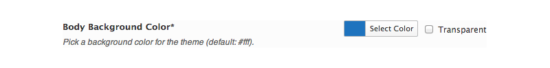

# Color

The Color field redefines simplicity. Point and click to chose any color in the spectrum.

<span style="display:block;text-align:center"></span>

::: warning Table of Contents
[[toc]]
:::

## Arguments

|Name|Type|Default|Description|
|--- |--- |--- |--- |
|type|string|`color`|Value identifying the field type.|
|id|string||Unique ID identifying the field. Must be different from all other field IDs.|
|title|string||Displays title of the option.|
|subtitle|string||Subtitle display of the option, situated beneath the title.|
|desc|string||Description of the option, appearing beneath the field control.|
|class|string||Appends any number of classes to the field's class attribute.|
|compiler|bool/array||Flag to run the compiler hook or array of CSS selectors to pass dynamic CSS to the compiler hook.  More info|
|output|array||Array of CSS selectors to dynamically generate CSS.  More info|
|required|array||Provide the parent, comparison operator, and value which affects the field's visibility.  More info|
|default|string||Hex string representing the default color.|
|transparent|bool|true|Flag to set the display of the transparency checkbox.|
|validate|string||String value of the validation type to validate.  The only accepted value is `color`.|
|permissions|string||String specifying the capability required to view the section.   More info.|
|hint|array||Array containing the `content` and optional `title` arguments for the hint tooltip. More info|

::: warning Transparency
To set the transparency checkbox by default, use the string `transparent` in place of a string hex value  in the `default` argument.
:::

::: tip Also See
- [Using the `compiler` Argument](../configuration/argument/compiler.md)
- [Using the `hints` Argument](../configuration/argument/hints.md)
- [Using the `output` Argument](../guide/the-output-argument.md)
- [Using the `permissions` Argument](../configuration/argument/permissions.md)
- [Using the `required` Argument](../configuration/argument/required.md)
:::

## Example Declaration

```php
Redux::addField( 'OPT_NAME', 'SECTION_ID', array(
    'id'       => 'opt-color',
    'type'     => 'color',
    'title'    => __('Body Background Color', 'redux-framework-demo'), 
    'subtitle' => __('Pick a background color for the theme (default: #fff).', 'redux-framework-demo'),
    'default'  => '#FFFFFF',
    'validate' => 'color',
) );
```

## Example Usage
This example in based on the example usage provided above. Be sure to change `$redux_demo` to the value you specified in your <a title="opt_name" href="/redux-framework/arguments/opt_name/">`opt_name` argument.</a>

```php
global $redux_demo;

echo 'Color value: ' . $redux_demo['opt-color'];
```
