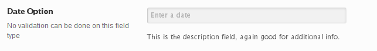

# Date

The Date field displays the popup jQuery datebox when clicking on the text input.

<span style="display:block;text-align:center"></span>

::: warning Table of Contents
[[toc]]
:::

## Arguments
|Name|Type|Default|Description|
|--- |--- |--- |--- |
|type|string|`date`|Value identifying the field type.|
|id|string||Unique ID identifying the field. Must be different from all other field IDs.|
|title|string||Displays title of the option.|
|subtitle|string||Subtitle display of the option, situated beneath the title.|
|desc|string||Description of the option, appearing beneath the field control.|
|class|string||Appends any number of classes to the field's class attribute.|
|compiler|bool||Flag to run the compiler hook.  More info|
|required|array||Provide the parent, comparison operator, and value which affects the field's visibility.   More info|
|placeholder|string||The default text to display in the text input when no value is present.|
|permissions|string||String specifying the capability required to view the section.   More info.|
|hint|array||Array containing the `content` and optional `title` arguments for the hint tooltip. More info|

::: tip Also See
- [Using the `compiler` Argument](../configuration/argument/compiler.md)
- [Using the `hints` Argument](../configuration/argument/hints.md)
- [Using the `permissions` Argument](../configuration/argument/permissions.md)
- [Using the `required` Argument](../configuration/argument/required.md)
:::

## Example Declaration
```php
Redux::addField( 'OPT_NAME', 'SECTION_ID', array(
    'id'          => 'opt-date',
    'type'        => 'date',
    'title'       => __('Date Option', 'redux-framework-demo'), 
    'subtitle'    => __('No validation can be done on this field type', 'redux-framework-demo'),
    'desc'        => __('This is the description field, again good for additional info.', 'redux-framework-demo'),
    'placeholder' => 'Click to enter a date'
) );
```

## Example Usage
This example in based on the example usage provided above. Be sure to change `$redux_demo` to the value you specified in your <a title="opt_name" href="/redux-framework/arguments/opt_name/">`opt_name` argument.</a>

```php
global $redux_demo;

echo '' . $redux_demo['opt-date'];
```

