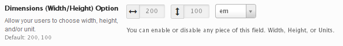

# Dimensions

The Dimensions field comes in handy when allowing users the ability to set the width, height and unit value of any HTML element that supports those properties.

<span style="display:block;text-align:center"></span>

::: warning Table of Contents
[[toc]]
:::

## Arguments
|Name|Type|Default|Description|
|--- |--- |--- |--- |
|type|string|`dimensions`|Value identifying the field type.|
|mode|array|<pre class="language-php codecopy-enabled"><code>array(<br/>&nbsp;&nbsp;'width' => false,<br/>&nbsp;&nbsp;'height' => false <br/>)</code></pre>|Setting a value for width or height overrides the dynamic CSS output generated by Redux to match the string you specify.|
|default|string||See [Default Argument](#default-argument) below.|
|width|bool|`true`|Flag to display the width input.|
|height|bool|`true`|Flag to display the height input.|
|units|string/bool/array|`px`|Specify a string to pass a single unit value.  Specify an array to pass an array of unit values.  Specify `false` to hide the units selector.  Accepts: `px` `em` `%`.|
|units_extended|bool|`false`|Flag to allow users to select any type of unit.|
|select2|array||Array of select2 arguments. [Select2 Documentation](https://select2.org/configuration/options-api).|

::: tip Also See
- [Global Field Arguments](../configuration/fields/arguments.md)
- [Using the `compiler` Argument](../configuration/fields/compiler.md)
- [Using the `output` Argument](../configuration/fields/output.md)
- [Using the `output_variables` Argument](../configuration/fields/output-variables.md)
- [Using the `permissions` Argument](../configuration/fields/permissions.md)
- [Using the `required` Argument](../configuration/fields/required.md)
:::

## Default Argument
|Name|Type|Description|
|--- |--- |--- |
|width|string|Default value to display.|
|height|string|Default value to display.|
|units|string|Default unit to display.  When unspecified, `px` is used by default.|

::: tip
The `name` properties also serve as the input placeholder text when no value is present.  it is acceptable to capitalize them, if desired.
:::


## Generate a Declaration
<script>
import builder from './dimensions.json';
export default {
    data () {
        return {
            builder: builder,
            defaults: {}
        };
    }
}
</script>
<builder :builder_json="builder" :builder_defaults="defaults" />

## Example Declaration
```php
Redux::addField( 'OPT_NAME', 'SECTION_ID', array(
    'id'       => 'opt_dimensions',
    'type'     => 'dimensions',
    'units'    => array('em','px','%'),
    'title'    => __('Dimensions (Width/Height) Option', 'redux-framework-demo'),
    'subtitle' => __('Allow your users to choose width, height, and/or unit.', 'redux-framework-demo'),
    'desc'     => __('Enable or disable any piece of this field. Width, Height, or Units.', 'redux-framework-demo'),
    'default'  => array(
        'Width'   => '200', 
        'Height'  => '100'
    ),
) );
```

## Example Usage
This example in based on the example usage provided above. Be sure to change `$redux_demo` to the value you specified in your [opt_name](../configuration/global_arguments.md#opt_name) argument.

```php
global $redux_demo;

echo 'Width value: '  . $redux_demo['opt_dimensions']['width'];
echo 'Height value: ' . $redux_demo['opt_dimensions']['height'];
echo 'Unit value: '   . $redux_demo['opt_dimensions']['units'];
```

