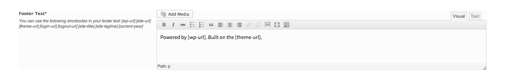

# Editor

The Editor field offers WYSIWYG editing capability, using the same editing interface as WordPress itself.

<span style="display:block;text-align:center"></span>

::: warning Table of Contents
[[toc]]
:::

## Arguments
|Name|Type|Default|Description|
|--- |--- |--- |--- |
|type|string|`editor`|Value identifying the field type.|
|id|string||Unique ID identifying the field. Must be different from all other field IDs.|
|title|string||Displays title of the option.|
|subtitle|string||Subtitle display of the option, situated beneath the title.|
|desc|string||Description of the option, appearing beneath the field control.|
|class|string||Appends any number of classes to the field's class attribute.|
|compiler|bool||Flag to run the compiler hook.  More info|
|required|array||Provide the parent, comparison operator, and value which affects the field's visibility.  More info|
|default|string||Text to appear inside the editor window by default.|
|args|array||Sets the default WordPress editor arguments.  See 'WP Editor Options' below.|
|permissions|string||String specifying the capability required to view the section.   More info.|
|hint|array||Array containing the `content` and optional `title` arguments for the hint tooltip. More info|

::: tip Also See
- [Using the `compiler` Argument](../configuration/argument-compiler.md)
- [Using the `hints` Argument](../configuration/argument-hints.md)
- [Using the `permissions` Argument](../configuration/argument-permissions.md)
- [Using the `required` Argument](../configuration/argument-required.md)
:::

## WP Editor Options
|Name|Type|Default|Description|
|--- |--- |--- |--- |
|wpautop|bool|true|Flags to set wpautop for adding paragraphs.|
|media_buttons|bool|true|Flag to set the display of media upload/inset buttons.|
|textarea_rows|int|`10`|Number of rows to display or the textarea.|
|tabindex|int||The tabindex value used for the form field.|
|editor_css|string||Additional CSS styling applied for both visual and HTML editor buttons. `<style>` tags need to be included.|
|teeny|bool|true|Flag to set the editor with minimal configuration.|
|dfw|bool|false|Flag to replace the default fullscreen editor with DFW.  Needs specific DOM elements and CSS. This is an advanced setting for use by advanced users.|
|tinymce|array||Flag to load TinyMCE. Can be used to pass settings directly to TinyMCE using an array.|
|quicktags|array||Flag to load Quicktags. Can be used to pass settings directly to Quicktags using an array. Set to false to remove the editor's Visual and Text tabs.|


::: tip
 While the `textarea_name` value is available for the WP Editor options, Redux automatically sets this value for you. There is no real need to set it manually. The `editor_class` value, also part of the WP Editor settings does not need to be set via the `args` array. It can be set via the `class` type.
:::

## Example Declaration
```php
Redux::addField( 'OPT_NAME', 'SECTION_ID', array(
    'id'               => 'editor-text',
    'type'             => 'editor',
    'title'            => __('Editor Text', 'redux-framework-demo'), 
    'subtitle'         => __('Subtitle text would go here.', 'redux-framework-demo'),
    'default'          => 'Powered by Redux.',
    'args'   => array(
        'teeny'            => true,
        'textarea_rows'    => 10
    )
) );
```

## Example Usage
This example in based on the example usage provided above. Be sure to change `$redux_demo` to the value you specified in your <a title="opt_name" href="/redux-framework/arguments/opt_name/">`opt_name` argument.</a>

```php
global $redux_demo;

echo 'Editor text: ' . $redux_demo['editor-text'];

```

