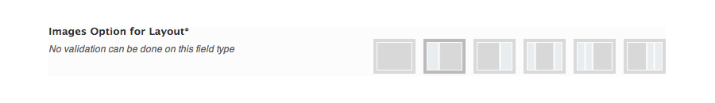

# Image Select

Select from an array of images as radio buttons.

<span style="display:block;text-align:center"></span>

::: warning Table of Contents
[[toc]]
:::

## Arguments
|Name|Type|Default|Description|
|--- |--- |--- |--- |
|type|string|`image_select`|Value identifying the field type.|
|id|string||Unique ID identifying the field. Must be different from all other field IDs.|
|title|string||Displays title of the option.|
|subtitle|string||Subtitle display of the option, situated beneath the title.|
|desc|string||Description of the option, appearing beneath the field control.|
|class|string||Appends any number of classes to the field's class attribute.|
|compiler|bool/array||Flag to run the compiler hook or array of CSS selectors to pass dynamic CSS to the compiler hook.  More info|
|output|array||Array of CSS selectors to dynamically generate CSS.  More info|
|mode|string|'background-image'|CSS selector in which to assign the returned image value.|
|required|array||Provide the parent, comparison operator, and value which affects the field's visibility.  More info|
|options|array||Set of key pair array values representing the layout options.  See 'Layout Options' below.|
|default|string/int||Key value of the default option array to select.|
|width|string||Set the width of the images used in `options`.|
|height|string||Set the height of the images used in `options`.|
|tiles|bool|false|Flag to set tiling for the array of `options` images.|
|presets|bool|false|Flag to permit the use of a JSON string or array to override multiple preferences.|
|permissions|string||String specifying the capability required to view the section.   More info.|
|hint|array||Array containing the `content` and optional `title` arguments for the hint tooltip.  More info|

::: tip Also See
- [Using the `compiler` Argument](../configuration/argument-compiler.md)
- [Using the `hints` Argument](../configuration/argument-hints.md)
- [Using the `output` Argument](../guide/the-output-argument.md)
- [Using the `permissions` Argument](../configuration/argument-permissions.md)
- [Using the `required` Argument](../configuration/argument-required.md)
:::

### Layout Options
|Name|Type|Description|
|--- |--- |--- |
|alt|string|Alt test for the layout image.|
|title|string|Title for the layout image.|
|img|string|URL of the image.|
|presets|string/array|For use with preset.  Optional array or JSON string of values for specified fields|
|class|string|Extra class name for the layout image.|

## Example Declaration
#### Image Select Layout

```php
Redux::addField( 'OPT_NAME', 'SECTION_ID', array(
    'id'       => 'opt-layout',
    'type'     => 'image_select',
    'title'    => __('Main Layout', 'redux-framework-demo'), 
    'subtitle' => __('Select main content and sidebar alignment. Choose between 1, 2 or 3 column layout.', 'redux-framework-demo'),
    'options'  => array(
        '1'      => array(
            'alt'   => '1 Column', 
            'img'   => ReduxFramework::$_url.'assets/img/1col.png'
        ),
        '2'      => array(
            'alt'   => '2 Column Left', 
            'img'   => ReduxFramework::$_url.'assets/img/2cl.png'
        ),
        '3'      => array(
            'alt'   => '2 Column Right', 
            'img'  => ReduxFramework::$_url.'assets/img/2cr.png'
        ),
        '4'      => array(
            'alt'   => '3 Column Middle', 
            'img'   => ReduxFramework::$_url.'assets/img/3cm.png'
        ),
        '5'      => array(
            'alt'   => '3 Column Left', 
            'img'   => ReduxFramework::$_url.'assets/img/3cl.png'
        ),
        '6'      => array(
            'alt'  => '3 Column Right', 
            'img'  => ReduxFramework::$_url.'assets/img/3cr.png'
        )
    ),
    'default' => '2'
) );
```

#### Image Select Preset

```php
Redux::addField( 'OPT_NAME', 'SECTION_ID', array(
    'id'       => 'opt-presets',
    'type'     => 'image_select', 
    'presets'  => true,
    'title'    => __('Preset', 'redux-framework-demo'),
    'subtitle' => __('This allows you to set a json string or array to override multiple preferences in your theme.', 'redux-framework-demo'),
    'default'  => 0,
'desc'     => __('This allows you to set a json string or array to override multiple preferences in your theme.', 'redux-framework-demo'),
    'options'  => array(
        // Array of preset options
        '1'      => array(
            'alt'   => 'Preset 1', 
            'img'   => ReduxFramework::$_url.'../sample/presets/preset1.png', 
            'presets'   => array(
                'switch-on'     => 1,
                'switch-off'    => 1, 
                'switch-custom' => 1
            )
        ),
        // JSON string of preset options
        '2'       => array(
            'alt'     => 'Preset 2', 
            'img'     => ReduxFramework::$_url.'../sample/presets/preset2.png', 
            'presets' => '{"slider1":"1", "slider2":"0", "switch-on":"0"}'
        ),
    ),
) );
```

## Example Usage
This example in based on the example usage provided above. Be sure to change `$redux_demo` to the value you specified in your <a title="opt_name" href="/redux-framework/arguments/opt_name/">`opt_name` argument.</a>

```php
global $redux_demo;

echo 'Layout value: ' . $redux_demo['opt-layout'];
echo 'Preset value: ' . $redux_demo['opt-presets'];
```
