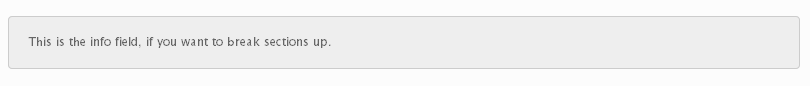
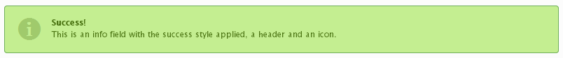
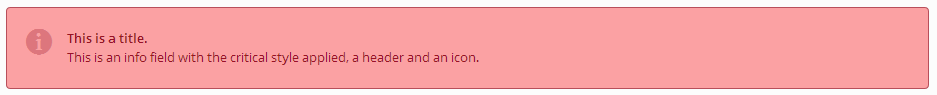

# Info

The Info field comes in several varieties to display information as normal, info warning and success formats.  Choose between the WordPress 3.8 styles, or the non-notice styles.

::: warning Table of Contents
[[toc]]
:::

## Arguments
|Name|Type|Default|Description|
|--- |--- |--- |--- |
|type|string|`info`|Value identifying the field type.|
|id|string||Unique ID identifying the field. Must be different from all other field IDs.|
|title|string||Displays title of the option.|
|subtitle|string||Subtitle display of the option, situated beneath the title.|
|desc|string||Description of the option, appearing beneath the field control.|
|class|string||Appends any number of classes to the field's class attribute.|
|required|array||Provide the parent, comparison operator, and value which affects the field's visibility.  More info|
|style|string|`normal`|Sets the mode of the info box.  Accepts:  `normal` `info` `warning` `success ```critical`` or `custom`|
|notice|bool|true|Set the styling to the non-notice styles, instead of the default WordPress 3.8 notice styles.|
|color|string||Color that becomes the left border if style is set to custom. Will not work with a non-notice styled field.|
|icon|string||Name of an Elusive Icon font to use in the info box.|
|indent|bool|`false`|If set, left field indent will be applied.|

::: tip Also See
- [Using the `required` Argument](../configuration/argument/required.md)
:::

::: warning Tip
When using the Info field with `required`, the field cannot be hidden by default.  It’s best only to use the `required` argument with this field when the fold is shown by default.
:::


## Example Declaration

#### Normal Style
<span style="display:block;text-align:center"></span>

```php
Redux::addField( 'OPT_NAME', 'SECTION_ID', array(
    'id'   => 'info_normal',
    'type' => 'info',
    'desc' => __('This is the info field, if you want to break sections up.', 'redux-framework-demo')
) );
```

#### Warning Style

<span style="display:block;text-align:center"></span>

```php
Redux::addField( 'OPT_NAME', 'SECTION_ID', array(
    'id'    => 'info_warning',
    'type'  => 'info',
    'title' => __('Danger, Will Robinson!', 'redux-framework-demo'),
    'style' => 'warning',
    'desc'  => __('This is an info field with the warning style applied and a header.', 'redux-framework-demo')
) );
```

#### Success Style

<span style="display:block;text-align:center"></span>

```php
Redux::addField( 'OPT_NAME', 'SECTION_ID', array(
    'id'    => 'info_success',
    'type'  => 'info',
    'style' => 'success',
    'title' => __('Success!', 'redux-framework-demo'),
    'icon'  => 'el-icon-info-sign',
    'desc'  => __( 'This is an info field with the success style applied, a header and an icon.', 'redux-framework-demo')
) );
```

#### Critical Style
<span style="display:block;text-align:center"></span>

```php
Redux::addField( 'OPT_NAME', 'SECTION_ID', array(
    'id' => 'info_critical',
    'type' => 'info',
    'style' => 'critical',
    'icon' => 'el-icon-info-sign',
    'title' => __('This is a title.', 'redux-framework-demo'),
    'desc' => __('This is an info field with the critical style applied, a header and an icon.', 'redux-framework-demo')
) );
```

