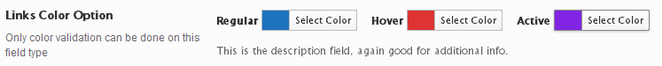

# Link Color

With the Link Color field, setting the hyperlink properties in a project is as east as selecting the desired colors.

<span style="display:block;text-align:center"></span>

::: warning Table of Contents
[[toc]]
:::

## Arguments
|Name|Type|Default|Description|
|--- |--- |--- |--- |
|type|string|`link_color`|Value identifying the field type.|
|id|string||Unique ID identifying the field. Must be different from all other field IDs.|
|title|string||Displays title of the option.|
|subtitle|string||Subtitle display of the option, situated beneath the title.|
|desc|string||Description of the option, appearing beneath the field control.|
|class|string||Appends any number of classes to the field's class attribute.|
|compiler|bool/array||Flag to run the compiler hook or array of CSS selectors to pass dynamic CSS to the compiler hook.  More info|
|output|array||Array of CSS selectors to dynamically generate CSS.  More info|
|required|array||Provide the parent, comparison operator, and value which affects the field's visibility.  More info|
|validate|string|`color`|String value of `color` to validate the chosen color.  More info.|
|default|array||Array of default values. See 'Default Options' below.|
|regular|bool|true|Flag to display the regular hyperlink color picker.|
|hover|bool|true|Flag to display the hover hyperlink color picker.|
|visited|bool|true|Flag to display the visited hyperlink color picker.|
|active|bool|true|Flag to display the active hyperlink color picker.|
|permissions|string||String specifying the capability required to view the section.   More info.|
|hint|array||Array containing the `content` and optional `title` arguments for the hint tooltip.  More info|

::: tip Also See
- [Using the `compiler` Argument](../configuration/argument-compiler.md)
- [Using the `hints` Argument](../configuration/argument-hints.md)
- [Using the `output` Argument](../guide/the-output-argument.md)
- [Using the `permissions` Argument](../configuration/argument-permissions.md)
- [Using the `required` Argument](../configuration/argument-required.md)
- [Using the `validate` Argument](../configuration/argument-validate.md)
:::


## Default Options
|Name|Type|Description|
|--- |--- |--- |
|regular|string|Hex string for the default regular hyperlink color.|
|hover|string|Hex string for the default hover hyperlink color.|
|active|string|Hex string for the default active hyperlink color.|
|visited|string|Hex string for the default visited hyperlink color.|

## Example Declaration
```php
Redux::addField( 'OPT_NAME', 'SECTION_ID', array(
    'id'       => 'opt-link-color',
    'type'     => 'link_color',
    'title'    => __('Links Color Option', 'redux-framework-demo'),
    'subtitle' => __('Only color validation can be done on this field type', 'redux-framework-demo'),
    'desc'     => __('This is the description field, again good for additional info.', 'redux-framework-demo'),
    'default'  => array(
        'regular'  => '#1e73be', // blue
        'hover'    => '#dd3333', // red
        'active'   => '#8224e3',  // purple
        'visited'  => '#8224e3',  // purple
    )
) );
```

## Example Usage
This example in based on the example usage provided above. Be sure to change `$redux_demo` to the value you specified in your <a title="opt_name" href="/redux-framework/arguments/opt_name/">`opt_name` argument.</a>

```php
global $redux_demo;

echo 'Regular color value: ' . $redux_demo['opt-link-color']['regular'];
echo 'Hover color value: '   . $redux_demo['opt-link-color']['hover'];
echo 'Active color value: '  . $redux_demo['opt-link-color']['active'];
echo 'Visited color value: ' . $redux_demo['opt-link-color']['visited'];
```

