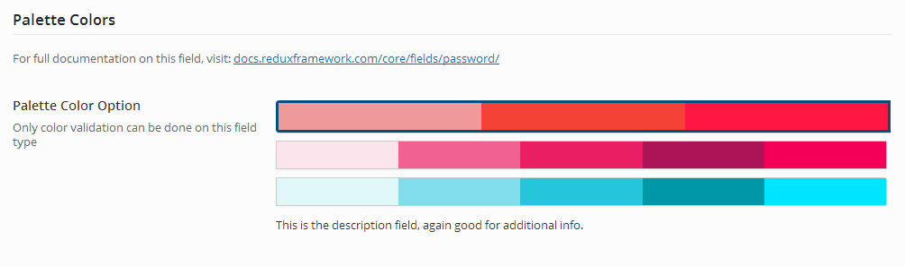

# Palette Color

The Palette Color field allows you to display a set of color palettes that a theme or plugin might use throughout, giving your users a choice of UI colors.

<span style="display:block;text-align:center"></span>

::: warning Table of Contents
[[toc]]
:::

## Arguments
|Name|Type|Default|Description|
|--- |--- |--- |--- |
|Name|Type|Default|Description|
|type|string|`palette`|Value identifying the field type.|
|id|string||Unique ID identifying the field. Must be different from all other field IDs.|
|title|string||Displays title of the option.|
|subtitle|string||Subtitle display of the option, situated beneath the title.|
|desc|string||Description of the option, appearing beneath the field control.|
|class|string||Appends any number of classes to the field's class attribute.|
|compiler|bool/array||Flag to run the compiler hook or array of CSS selectors to pass dynamic CSS to the compiler hook.  More info|
|required|array||Provide the parent, comparison operator, and value which affects the field's visibility.  More info|
|palettes|array||An array of individual arrays defining the color palettes.  See "Setting Palettes" below.|
|default|string||They key of the default palettes array to set as default.|
|hint|array||Array containing the `content` and optional `title` arguments for the hint tooltip.  More info|

::: tip Also See
- [Using the `compiler` Arguments`](../guide/the-compiler-argument.md)
- [Using the `hints` Argument](../guide/the-hints-argument.md)
- [Using the `permissions` Argument](../guide/the-permissions-argument.md)
- [Using the `required` Argument](../guide/using-the-required-argument.md)
:::

## Setting Palettes
Each palette in the palettes argument is a key/pair array that defines each individual palette.  The key of the array is the palette name.  Assigned to the key is an array of hex colors to be displayed in the palette entry.  See the example below for a complete breakdown.

## Example Declaration
```php
Redux::set_section( $opt_name, array(
    'title'      => __( 'Palette Colors', 'redux-framework-demo' ),
    'desc'       => __( 'For full documentation on this field, visit: ', 'redux-framework-demo' ) . '<a href="//docs.reduxframework.com/core/fields/palette-color/" target="_blank">docs.reduxframework.com/core/fields/palette-color/</a>',
    'id'         => 'color-palette',
    'subsection' => true,
    'fields'     => array(
        array(
            'id'       => 'opt-palette-color',
            'type'     => 'palette',
            'title'    => __( 'Palette Color Option', 'redux-framework-demo' ),
            'subtitle' => __( 'Only color validation can be done on this field type', 'redux-framework-demo' ),
            'desc'     => __( 'This is the description field, again good for additional info.', 'redux-framework-demo' ),
            'default'  => 'red',
            'palettes' => array(
                'red'  => array(
                    '#ef9a9a',
                    '#f44336',
                    '#ff1744',
                ),
                'pink' => array(
                    '#fce4ec',
                    '#f06292',
                    '#e91e63',
                    '#ad1457',
                    '#f50057',
                ),
                'cyan' => array(
                    '#e0f7fa',
                    '#80deea',
                    '#26c6da',
                    '#0097a7',
                    '#00e5ff',
                ),
            )
        ),
    )
) );
```

## Example Usage
This example in based on the example usage provided above. Be sure to change `$redux_demo` to the value you specified in your <a title="opt_name" href="/redux-framework/arguments/opt_name/">`opt_name` argument.  </a>

This field does NOT return the palette array.  It returns the name of the selected palette.  Ideally, the developer will have set the palette colors in their CSS, using the palette key name as the CSS selector.

```php
global $redux_demo;

echo 'Selected palette: ' . $redux_demo['opt-palette-color'];

// Outputs: Selected palette: red 
```
