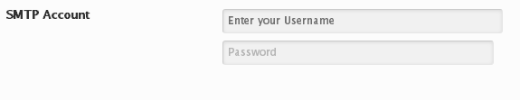

# Password

The Password field, which can be used as a login with password could be used as a POP or SMTP login for other site functions.

<span style="display:block;text-align:center"></span>

::: warning Table of Contents
[[toc]]
:::

## Arguments
|Name|Type|Default|Description|
|--- |--- |--- |--- |
|type|string|`password`|Value identifying the field type.|
|default|array||See [Default Argument](#default-argument) below.|
|placeholder|string|<pre class="language-php codecopy-enabled"><code><span class="token keyword">array</span><span class="token punctuation">(</span><br />&nbsp;&nbsp;<span class="token single-quoted-string string">'username'</span>   <span class="token operator">=</span><span class="token operator">&gt;</span> <span class="token function">__</span><span class="token punctuation">(</span> <span class="token single-quoted-string string">'Username'</span> <span class="token punctuation">)</span><span class="token punctuation">,</span><br />&nbsp;&nbsp;<span class="token single-quoted-string string">'password'</span>   <span class="token operator">=</span><span class="token operator">&gt;</span> <span class="token function">\__</span><span class="token punctuation">(</span> <span class="token single-quoted-string string">'Password'</span> <span class="token punctuation">)</span><br/>)</code></pre>|Default placeholder values.|
|username|bool|`true`|Enable/Disable the username field along side the password field.|

::: tip Also See
- [Global Field Arguments](../configuration/fields/arguments.md)
- [Using the `compiler` Argument](../configuration/fields/compiler.md)
- [Using the `permissions` Argument](../configuration/fields/permissions.md)
- [Using the `required` Argument](../configuration/fields/required.md)
:::

## Default Argument
|Name|Type|Description|
|--- |--- |--- |
|username|string|Default text to appear in the username field.|
|password|string|Default text to appear in the password field.|

## Placeholder Options
|Name|Type|Description|
|--- |--- |--- |
|username|string|Placeholder text for the username field.|
|password|string|Placeholder text for the password field.|

## Example Declaration
<script>
import builder from './password.json';
export default {
    data () {
        return {
            builder: builder,
            defaults: {
                'color'       : '#333', 
                'font-style'  : '700', 
                'font-family' : 'Abel', 
                'google'      : true,
                'font-size'   : '33px', 
                'line-height' : '40'
            }
        };
    }
}
</script>
<builder :builder_json="builder" :builder_defaults="defaults" />


## Example Declaration
```php
Redux::addField( 'OPT_NAME', 'SECTION_ID', array(
    'id'          => 'opt-password',
    'type'        => 'password',
    'username'    => true,
    'title'       => __( 'SMTP Account', 'redux-framework-demo' ),
    'placeholder' => array(
        'username'   => __( 'Enter your Username', 'redux-framework-demo' ),
        'password'   => __( 'Enter your Password', 'redux-framework-demo' ),
    )
) );
```

## Example Usage
This example in based on the example usage provided above. Be sure to change `$redux_demo` to the value you specified in your [opt_name](../configuration/global_arguments.md#opt_name) argument.

```php
global $redux_demo;

echo 'Username value:' . $redux_demo['opt-password']['username'];
echo 'Password value:' . $redux_demo['opt-password']['password'];
```

