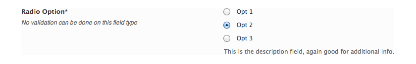

# Radio

The Radio field is an excellent way to present a set of choices for users to select from.

<span style="display:block;text-align:center"></span>

::: warning Table of Contents
[[toc]]
:::

## Arguments
|Name|Type|Default|Description|
|--- |--- |--- |--- |
|type|string|`radio`|Value identifying the field type.|
|id|string||Unique ID identifying the field. Must be different from all other field IDs.|
|title|string||Displays title of the option.|
|subtitle|string||Subtitle display of the option, situated beneath the title.|
|desc|string||Description of the option, appearing beneath the field control.|
|class|string||Appends any number of classes to the field's class attribute.|
|compiler|bool||Flag to run the compiler hook.  More info|
|required|array||Provide the parent, comparison operator, and value which affects the field's visibility.  More info|
|default|string/int||Value indicated the key value of the options array to set as default.|
|options|array||Array of key pair values representing the radio buttons.  The key value should be numbers in sequential order, beginning with `1`.  The value parameter accepts the text to display beside the radio button.|
|data|string||Sets the radio option values with WordPress data.  Accepts: `category` `categories` `menu` `menus` `menu_location` `menu_locations` `page` `pages` `post` `posts` `post_type` `post_types` `tag` `tags` `taxonomy` `taxonomies` `roles` `sidebar` `sidebars` `capabilities`  More info|
|args|array||WordPress arguments specific to the specified data.|
|permissions|string||String specifying the capability required to view the section.   More info.|
|hint|array||Array containing the `content` and optional `title` arguments for the hint tooltip.  More info|

::: tip Also See
- [Using the `compiler` Argument](../configuration/argument/compiler.md)
- [Using the `hints` Argument](../configuration/argument/hints.md)
- [Using the `permissions` Argument](../configuration/argument/permissions.md)
- [Using the `required` Argument](../configuration/argument/required.md)
:::

### Example Declaration
```php
Redux::addField( 'OPT_NAME', 'SECTION_ID', array(
    'id'       => 'opt-radio',
    'type'     => 'radio',
    'title'    => __('Radio Option', 'redux-framework-demo'), 
    'subtitle' => __('No validation can be done on this field type', 'redux-framework-demo'),
    'desc'     => __('This is the description field, again good for additional info.', 'redux-framework-demo'),
    //Must provide key => value pairs for radio options
    'options'  => array(
        '1' => 'Opt 1', 
        '2' => 'Opt 2', 
        '3' => 'Opt 3'
    ),
    'default' => '2'
) );
```

### Example Usage
This example in based on the example usage provided above. Be sure to change `$redux_demo` to the value you specified in your <a title="opt_name" href="/redux-framework/arguments/opt_name/">`opt_name` argument.</a> Only the key of the select `options` array item will be returned.

```php
global $redux_demo;

echo 'Selected Radio value: ' . $redux_demo['opt-radio'];
```
