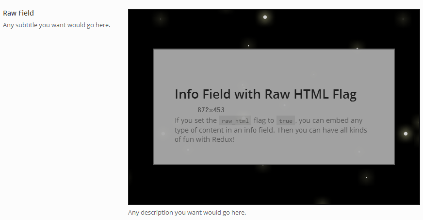

# Raw

The Raw field provides the ability to output raw HTML directly into the options panel both full width and sectioned.

::: warning Table of Contents
[[toc]]
:::

### Full Width
<span style="display:block;text-align:center"></span>

### Sectioned 
`'full_width' => false )`

<span style="display:block;text-align:center"></span>

## Arguments
|Name|Type|Default|Description|
|--- |--- |--- |--- |
|type|string|`raw`|Value identifying the field type.|
|id|string||Unique ID identifying the field. Must be different from all other field IDs.|
|title|string||Displays title of the option.|
|subtitle|string||Subtitle display of the option, situated beneath the title.|
|desc|string||Description of the option, appearing beneath the field control.|
|class|string||Appends any number of classes to the field's class attribute.|
|required|array||Provide the parent, comparison operator, and value which affects the field's visibility.  More info|
|full_width|true||Flag to set denote if the field is full width or sectioned.|
|markdown|bool||Flag to set the markdown of standard line-break and tab characters to HTML.|
|content|string||HTML content to display.  String values or file output may be used.|
|content_path|string||Full path to file that will be used as the content for this field.|
|hint|array||Array containing the `content` and optional `title` arguments for the hint tooltip.  More info|

::: tip Also See
- [Using the `hints` Argument](../configuration/argument/hints.md)
- [Using the `permissions` Argument](../configuration/argument/permissions.md)
:::

## Example Declaration
```php
Redux::addField( 'OPT_NAME', 'SECTION_ID', array(
    'id'       => 'opt-raw',
    'type'     => 'raw',
    'title'    => __('Raw output', 'redux-framework-demo'),
    'subtitle' => __('Subtitle text goes here.', 'redux-framework-demo'),
    'desc'     => __('This is the description field for additional info.', 'redux-framework-demo'),
    'content'  => file_get_contents(dirname(__FILE__) . '/myfile.txt')
) );
```

## Example Declaration with PHP Output

Sometimes you want to do more than just a flat file with raw, and acutally output the results of some PHP code. You
can easily do that with this approach.

```php
ob_start( ); // This tells PHP to start putting all output in a buffer.
echo "HERE I AM";
?>
Now we're in HTML mode! Everything here will be saved as text,
including line breaks!
<?php // And back to PHP mode
// Don't forget to use a full php here, the shortcode `<?` will get you in trouble!!!

echo "Now i'm here"; 
$output = ob_get_clean(); // Now everything is in our variable.

Redux::addField( 'OPT_NAME', 'SECTION_ID', array( 
    'id'       => 'opt-raw',
    'type'     => 'raw',
    'title'    => __('Raw output', 'redux-framework-demo'),
    'subtitle' => __('Subtitle text goes here.', 'redux-framework-demo'),
    'desc'     => __('This is the description field for additional info.', 'redux-framework-demo'),
    'content'  => $output // Now let's set that in the raw field.
) );
```
