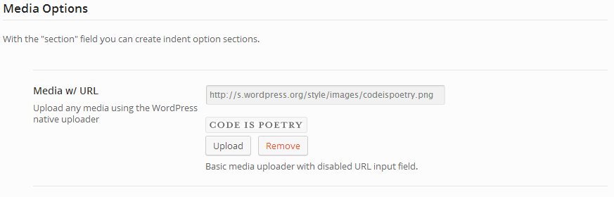

# Section

The Section field provides the ability to set any field below it with an indent.

::: warning Table of Contents
[[toc]]
:::

<span style="display:block;text-align:center"></span>

## Arguments
|Name|Type|Default|Description|
|--- |--- |--- |--- |
|type|string|'section'|Value identifying the field type.|
|id|string||Unique ID identifying the field. Must be different from all other field IDs.|
|title|string||Displays title of the option.|
|subtitle|string||Subtitle display of the option, situated beneath the title.|
|desc|string||Description of the option, appearing beneath the field control.|
|class|string||Appends any number of classes to the field's class attribute.|
|required|array||Provide the parent, comparison operator, and value which affects the field's visibility.  More info|
|indent|bool|true|Flag to set the indentation for all fields that follow. ALWAYS use this. `true` for a starting section field, `false` for a closing section field.|
|hint|array||Array containing the `content` and optional `title` arguments for the hint tooltip.  More info|

::: tip Also See
- [Using the `hints` Argument](../configuration/argument-hints.md)
- [Using the `required` Argument](../configuration/argument-required.md)
:::

::: tip
When using `required` with the section field, the required statement <strong>must</strong> be included in both the beginning and end section arrays.   Also, the section field cannot be hidden by default.  It’s best only to use the `required` argument with this field when the fold is shown by default.
:::

## Example Declaration
```php
// Begin the section
$fields = array(
   'id' => 'section-start',
   'type' => 'section',
   'title' => __('Indented Options', 'redux-framework-demo'),
   'subtitle' => __('With the "section" field you can create indent option sections.', 'redux-framework-demo'),
   'indent' => true 
);

// Other field arrays go here.
$fields[] = array();

// End the section
$fields[] = array(
    'id'     => 'section-end',
    'type'   => 'section',
    'indent' => false,
);
```

