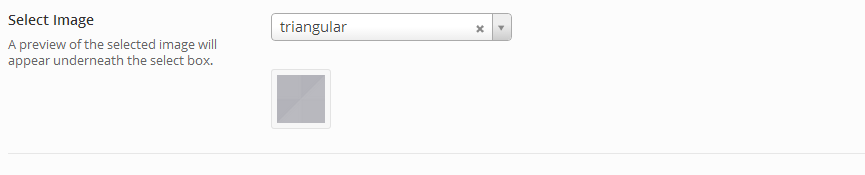

# Select Image

The Select Image field offers the ability to populate a drop-down field with an array of images names.  When selected, a preview of the image appears underneath.

<span style="display:block;text-align:center"></span>

::: warning Table of Contents
[[toc]]
:::

## Arguments
|Name|Type|<div style="width:135px;">Default</div>|Description|
|--- |--- |--- |--- |
|type|string|`select_image`|Value identifying the field type.|
|options|array||Array of arrays in the following format:<br /><pre class="language-php codecopy-enabled"><code><span class="token keyword">array</span><span class="token punctuation">(</span><br />&nbsp;&nbsp;<span class="token single-quoted-string string">'alt'</span> <span class="token operator">=</span><span class="token operator">&gt;</span> <span class="token function">__</span><span class="token punctuation">(</span> <span class="token single-quoted-string string">'Image One'</span><span class="token punctuation">,</span> <span class="token single-quoted-string string">'redux-framework-demo'</span><span class="token punctuation">)</span><span class="token punctuation">,</span><br />&nbsp;&nbsp;<span class="token single-quoted-string string">'img'</span> <span class="token operator">=</span><span class="token operator">&gt;</span> <span class="token single-quoted-string string">'http://yoursite.com/image.png'</span> </span><br/>)</code></pre>|
|default|string||Full URL of the default image.|
|placeholder|string|`Select an item`|Text to display in the selector when no value is present.|

::: tip Also See
- [Global Field Arguments](../configuration/fields/arguments.md)
- [Using the `compiler` Argument](../configuration/fields/compiler.md)
- [Using the `permissions` Argument](../configuration/fields/permissions.md)
- [Using the `required` Argument](../configuration/fields/required.md)
:::


## Build Config
<script>
import builder from './select-image.json';
export default {
    data () {
        return {
            builder: builder,
            defaults: {}
        };
    }
}
</script>
<builder :builder_json="builder" :builder_defaults="defaults" />

## Example Config
```php
Redux::addField( 'OPT_NAME', 'SECTION_ID', array(
    'id'       => 'opt-select-image',
    'type'     => 'select_image',
    'title'    => __('Select Image', 'redux-framework-demo'),
    'subtitle' => __('A preview of the selected image will appear underneath the select box.', 'redux-framework-demo'),
    'desc'     => __('This is the description field, again good for additional info.', 'redux-framework-demo'),
    'options'  => array(
        array (
             'alt'  => 'Image Name 1',
             'img'  => $url_to_img_1,
        ),
        array (
             'alt'  => 'Image Name 2',
             'img'  => $url_to_img_2,
        )
    ),
    'default'  => $url_to_img_1,
) );
```

## Example Usage
This example in based on the example usage provided above. Be sure to change `$redux_demo` to the value you specified in your [opt_name](../configuration/global_arguments.md#opt_name) argument.

```php
global $redux_demo;

echo '' . $redux_demo['opt-select-image'];
```
