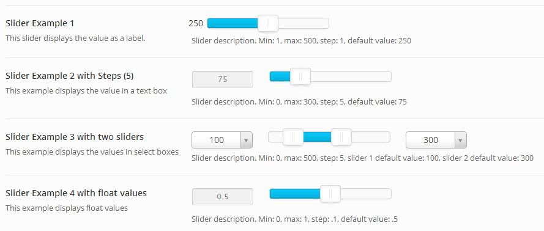

# Slider

The Redux Slider Field offers a great array features for just about every need.  We offer dual handles, floating point values, text/label/select output and theme responsiveness!

<span style="display:block;text-align:center"></span>

::: warning Table of Contents
[[toc]]
:::

## Arguments
|Name|Type|Default|Description|
|--- |--- |--- |--- |
|type|string|`slider`|Value identifying the field type.|
|min|int/float|`0`|Value setting the minimum slider value.|
|max|int/float|`1`|Value setting the maximum slider value.|
|step|int/float|`1`|Value setting the slider step value.|
|handles|int|`1`|Sets the number of slider handles, either `1` or `2`. Any other value will default to `1`|
|display_value|string|`text`|Sets output mode for the slider value. Accepted values include `none` for no output, `label` for a printed value, `text` for an editable text box, or `select` for a select box of values. Any other or incorrect values will default to `text`.|
|resolution|int/float|`1`|Sets the value's decimal significance. Acceptable values are: `1`, `0.1`, `0.01`, `0.001`, `0.0001`, `0.00001`. Any improper value will default to `1`.|
|float_mark|string|(decimal)|Sets the floating point marker to either `.` (decimal) or `,` (comma). Any other value will default to the decimal value.|
|select2|array||Array of select2 arguments. For more information see the 'Constructor' section of the Select2 docs.  Only applies when `display_value` is set to `select`.|

::: tip Also See
- [Global Field Arguments](../configuration/fields/arguments.md)
- [Using the `compiler` Argument](../configuration/fields/compiler.md)
- [Using the `output` Argument](../configuration/fields/output.md)
- [Using the `output_variables` Argument](../configuration/fields/output-variables.md)
- [Using the `permissions` Argument](../configuration/fields/permissions.md)
- [Using the `required` Argument](../configuration/fields/required.md)
:::

::: warning NOTE
When setting the `resolution` argument to a floating point value, it will also be necessary to set the `step` argument to a floating point for values after the decimal point to change value. Not doing so will result in the value to the left of the decimal changing value upon slide.
:::


## Build Config
<script>
import builder from './slider.json';
export default {
    data () {
        return {
            builder: builder,
            defaults: {}
        };
    }
}
</script>
<builder :builder_json="builder" :builder_defaults="defaults" />


## Example Config(s) 

#### Default
```php
Redux::addField( 'OPT_NAME', 'SECTION_ID', array(
    'id'        => 'opt-slider-label',
    'type'      => 'slider',
    'title'     => esc_html__('Slider Example 1', 'your-textdomain-here'),
    'subtitle'  => esc_html__('This slider displays the value as a label.', 'your-textdomain-here'),
    'desc'      => esc_html__('Slider description. Min: 1, max: 500, step: 1, default value: 250', 'your-textdomain-here'),
    "default"   => 250,
    "min"       => 1,
    "step"      => 1,
    "max"       => 500,
    'display_value' => 'label'
) );
```

#### Steps
```php
Redux::addField( 'OPT_NAME', 'SECTION_ID', array(
    'id' => 'opt-slider-text',
    'type' => 'slider',
    'title' => esc_html__('Slider Example 2 with Steps (5)', 'your-textdomain-here'),
    'subtitle' => esc_html__('This example displays the value in a text box', 'your-textdomain-here'),
    'desc' => esc_html__('Slider description. Min: 0, max: 300, step: 5, default value: 75', 'your-textdomain-here'),
    "default" => 75,
    "min" => 0,
    "step" => 5,
    "max" => 300,
    'display_value' => 'text'    
) );
```

#### Optional Display Text
```php
Redux::addField( 'OPT_NAME', 'SECTION_ID', array(
    'id' => 'opt-slider-text',
    'type' => 'slider',
    'title' => esc_html__('Slider Example 2 with Steps (5)', 'your-textdomain-here'),
    'subtitle' => esc_html__('This example displays the value in a text box', 'your-textdomain-here'),
    'desc' => esc_html__('Slider description. Min: 0, max: 300, step: 5, default value: 75', 'your-textdomain-here'),
    "default" => 75,
    "min" => 0,
    "step" => 5,
    "max" => 300,
    'display_value' => 'text'
) );
```

##### Two Sliders
```php
Redux::addField( 'OPT_NAME', 'SECTION_ID', array(
    'id' => 'opt-slider-select',
    'type' => 'slider',
    'title' => esc_html__('Slider Example 3 with two sliders', 'your-textdomain-here'),
    'subtitle' => esc_html__('This example displays the values in select boxes', 'your-textdomain-here'),
    'desc' => esc_html__('Slider description. Min: 0, max: 500, step: 5, slider 1 default value: 100, slider 2 default value: 300', 'your-textdomain-here'),
    "default" => array(
        1 => 100,
        2 => 300,
    ),
    "min" => 0,
    "step" => 5,
    "max" => "500",
    'display_value' => 'select',
    'handles' => 2, 
) );
```

#### Decimal Steps
```php
array(
    'id' => 'opt-slider-float',
    'type' => 'slider',
    'title' => esc_html__('Slider Example 4 with float values', 'your-textdomain-here'),
    'subtitle' => esc_html__('This example displays float values', 'your-textdomain-here'),
    'desc' => esc_html__('Slider description. Min: 0, max: 1, step: .1, default value: .5', 'your-textdomain-here'),
    "default" => .5,
    "min" => 0,
    "step" => .1,
    "max" => 1,
    'resolution' => 0.1,
    'display_value' => 'text'
) );

```
### Example Usage
This example in based on the example usage provided above. Be sure to change `$redux_demo` to the value you specified in your [opt_name](../configuration/global_arguments.md#opt_name) argument.

```php
global $redux_demo;

echo 'Slider label value: '  . $redux_demo['opt-slider-label'];
echo 'Slider text value: '   . $redux_demo['opt-slider-text'];
echo 'Slider select value: ' . $redux_demo['opt-slider-select'];
echo 'Slider float value: '  . $redux_demo['opt-slider-float'];
```

