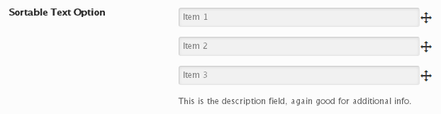

# Sortable

The Sortable field allows for an unlimited array of drag-and-drop text box inputs or check boxes.

<span style="display:block;text-align:center"></span>

::: warning Table of Contents
[[toc]]
:::

## Arguments
|Name|Type|<div style="width:85px;">Default</div>|Description|
|--- |--- |--- |--- |
|type|string|`sortable`|Value identifying the field type.|
|options|array||Array of key pair data defining the input objects.  The key represents the object's ID.  The second the display text.  See the example.|
|label|bool|`false`|Flag to display values before text areas when mode is not checkbox.|
|mode|string|`text`|Sets the mode of the input HTML. Options allowed are `text` or `checkbox`.|

::: tip Also See
- [Global Field Arguments](../configuration/fields/arguments.md)
- [Using the `compiler` Argument](../configuration/fields/compiler.md)
- [Using the `permissions` Argument](../configuration/fields/permissions.md)
- [Using the `required` Argument](../configuration/fields/required.md)
:::


## Generate a Declaration
<script>
import builder from './sortable.json';
export default {
    data () {
        return {
            builder: builder,
            defaults: {}
        };
    }
}
</script>
<builder :builder_json="builder" :builder_defaults="defaults" />


## Example Declaration
```php
// Checkbox mode
Redux::addField( 'OPT_NAME', 'SECTION_ID', array(
    'id'       => 'text-sortable',
    'type'     => 'sortable',
    'title'    => __('Sortable Text Option', 'redux-framework-demo'),
    'subtitle' => __('Define and reorder these however you want.', 'redux-framework-demo'),
    'desc'     => __('This is the description field, again good for additional info.', 'redux-framework-demo'),
    'mode'     => 'checkbox',
    'options'  => array(
        '1'     => 'Item 1',
        '2'     => 'Item 2',
        '3'     => 'Item 3',
    ),
    // For checkbox mode
    'default' => array(
        '1' => false,
        '2' => true,
        '3' => false
    ),
) );
```

#### Text mode
```php

Redux::addField( 'OPT_NAME', 'SECTION_ID', array(
    'id'       => 'text-sortable',
    'type'     => 'sortable',
    'title'    => __('Sortable Text Option', 'redux-framework-demo'),
    'subtitle' => __('Define and reorder these however you want.', 'redux-framework-demo'),
    'desc'     => __('This is the description field, again good for additional info.', 'redux-framework-demo'),
    'mode'     => 'text',
    'options' => array(
         '1' => 'Item number one',
         '2' => 'Number two here',
         '3' => 'Three strikes, yer out!',
    ),
) );
```
## Example Usage
This example in based on the example usage provided above. Be sure to change $redux_demo to the value you specified in your [opt_name](../configuration/global_arguments.md#opt_name) argument.

```php
global $redux_demo;

echo 'Text 1 value' . $redux_demo['text-sortable']['1'];
echo 'Text 2 value' . $redux_demo['text-sortable']['2'];
echo 'Text 3 value' . $redux_demo['text-sortable']['3'];
```

