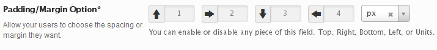

# Spacing

The Spacing field allows the user to specify either padding or margin units to any HTML element or CSS selector that supports them.

<span style="display:block;text-align:center"></span>

::: warning Table of Contents
[[toc]]
:::

## Arguments
|Name|Type|<div style="width:85px;">Default</div>|Description|
|--- |--- |--- |--- |
|type|string|`spacing`|Value identifying the field type.|
|units|array/string||String of a single unit or array of units.  Accepts: `false`, `%`, `in`, `cm`, `mm`, `em`, `rem`, `ex`, `pt`, `pc`, `px`, `vh`, `vw`, `vmin`, `vmax`, `ch`.|
|units_extended|bool|`false`|Flag to allow users to select any type of unit.|
|display_units|bool|`true`|Flag to set the display of the units field when units are specified.|
|top|bool|`true`|Flag to display the top value input.|
|bottom|bool|`true`|Flag to display the bottom value input.|
|left|bool|`true`|Flag to display the left value input.|
|right|bool|`true`|Flag to display the right value input.|
|all|bool|`false`|Flag to display all position value inputs.|
|mode|string|`padding`|Accepts:  `absolute` `padding` or `margin`.|
|select2|array||Array of select2 arguments. [Select2 Documentation](https://select2.org/configuration/options-api).|

::: tip Also See
- [Global Field Arguments](../configuration/fields/arguments.md)
- [Using the `compiler` Argument](../configuration/fields/compiler.md)
- [Using the `data` Argument](../configuration/fields/data.md)
- [Using the `output` Argument](../configuration/fields/output.md)
- [Using the `output_variables` Argument](../configuration/fields/output-variables.md)
- [Using the `permissions` Argument](../configuration/fields/permissions.md)
- [Using the `required` Argument](../configuration/fields/required.md)
:::

## Default Options
|Name|Type|Description|
|--- |--- |--- |
|*-top|string|Sets the top spacer value.|
|*-right|string|Sets the right spacer value.|
|*-bottom|string|Sets the bottom spacer value.|
|*-left|string|Sets the left spacer value.|
|units|string|Sets the default unit value in the unit selector.|

::: warning Notes
The asterisk at the beginning of these values is a wildcard value to be replaced with the `mode` name. For example, if the chosen `mode` is `margin`, the default names would be specified as `margin-top`, `margin-left`, etc. If the chosen `mode` is `padding`, the default names would be specified as `padding-top`, `padding-left`, etc.
When specifying your own units array, it will override the `units-extended` argument.
:::


## Build Config
<script>
import builder from './spacing.json';
export default {
    data () {
        return {
            builder: builder,
            defaults: {}
        };
    }
}
</script>
<builder :builder_json="builder" :builder_defaults="defaults" />

## Example Config
```php
Redux::addField( 'OPT_NAME', 'SECTION_ID', array(
    'id'             => 'opt-spacing',
    'type'           => 'spacing',
    'output'         => array('.site-header'),
    'mode'           => 'margin',
    'units'          => array('em', 'px'),
    'units_extended' => 'false',
    'title'          => esc_html__('Padding/Margin Option', 'your-textdomain-here'),
    'subtitle'       => esc_html__('Allow your users to choose the spacing or margin they want.', 'your-textdomain-here'),
    'desc'           => esc_html__('You can enable or disable any piece of this field. Top, Right, Bottom, Left, or Units.', 'your-textdomain-here'),
    'default'            => array(
        'margin-top'     => '1px', 
        'margin-right'   => '2px', 
        'margin-bottom'  => '3px', 
        'margin-left'    => '4px',
        'units'          => 'em', 
    )
) );
```

## Example Usage
This example in based on the example usage provided above. Be sure to change `$redux_demo` to the value you specified in your [opt_name](../configuration/global_arguments.md#opt_name) argument.

```php
global $redux_demo;

echo 'Spacing top: '    . $redux_demo['opt-spacing']['margin-top'];
echo 'Spacing bottom: ' . $redux_demo['opt-spacing']['margin-bottom'];
echo 'Spacing left: '   . $redux_demo['opt-spacing']['margin-left'];
echo 'Spacing right: '  . $redux_demo['opt-spacing']['margin-right'];
```

