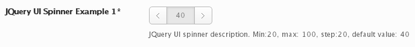

# Spinner

The Spinner field returns the value entered in its input box or via clicks on its arrow buttons.

<span style="display:block;text-align:center"></span>

::: warning Table of Contents
[[toc]]
:::

## Arguments
|Name|Type|Default|Description|
|--- |--- |--- |--- |
|type|string|`spinner`|Value identifying the field type.|
|min|string/int|0|Value to set the minimum spinner value.|
|max|string/int|1|Value to set the maximum spinner value.|
|step|string/int|1|Value to set the spinner step value.|

::: tip Also See
- [Global Field Arguments](../configuration/fields/arguments.md)
- [Using the `compiler` Argument](../configuration/fields/compiler.md)
- [Using the `permissions` Argument](../configuration/fields/permissions.md)
- [Using the `required` Argument](../configuration/fields/required.md)
:::

## Example Declaration
```php
Redux::addField( 'OPT_NAME', 'SECTION_ID', array(
    'id'       => 'opt-spinner',
    'type'     => 'spinner', 
    'title'    => __('JQuery UI Spinner Example 1', 'redux-framework-demo'),
    'subtitle' => __('No validation can be done on this field type','redux-framework-demo'),
    'desc'     => __('JQuery UI spinner description. Min:20, max: 100, step:20, default value: 40', 'redux-framework-demo'),
    'default'  => '40',
    'min'      => '20',
    'step'     => '20',
    'max'      => '100',
) );
```

## Example Usage
This example in based on the example usage provided above. Be sure to change `$redux_demo` to the value you specified in your <a title="opt_name" href="/redux-framework/arguments/opt_name/">`opt_name` argument.</a>

```php
global $redux_demo;

echo 'Spinner value: ' . $redux_demo['opt-spinner'];
```

