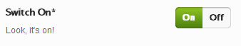

# Switch

The Switch field sets a true or false value based on the selection.  Users may also change the labels of the switch.

<span style="display:block;text-align:center"></span>

::: warning Table of Contents
[[toc]]
:::

## Arguments
|Name|Type|Default|Description|
|--- |--- |--- |--- |
|type|string|`switch`|Value identifying the field type.|
|on|string|`On`|Text displayed for the true value.|
|off|string|`Off`|Text displayed for the false value.|

::: tip Also See
- [Global Field Arguments](../configuration/fields/arguments.md)
- [Using the `compiler` Argument](../configuration/fields/compiler.md)
- [Using the `permissions` Argument](../configuration/fields/permissions.md)
- [Using the `required` Argument](../configuration/fields/required.md)
:::

## Build Config
<script>
import builder from './switch.json';
export default {
  data () {
      return {
          builder: builder
      };
  }
}
</script>
<builder :builder_json="builder" />

## Example Config
```php
Redux::add_field( 'OPT_NAME', 'SECTION_ID', array(
    'id'       => 'opt-switch',
    'type'     => 'switch', 
    'title'    => esc_html__('Switch On', 'your-textdomain-here'),
    'subtitle' => esc_html__('Look, it\'s on!', 'your-textdomain-here'),
    'default'  => true,
) );
```

## Example Usage
This example in based on the example usage provided above. Be sure to change `$redux_demo` to the value you specified in your [opt_name](../configuration/global_arguments.md#opt_name) argument.

```php
global $redux_demo;

echo 'Switch value: ' . $redux_demo['opt-switch'];
```

