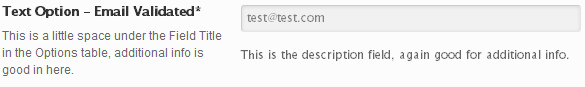
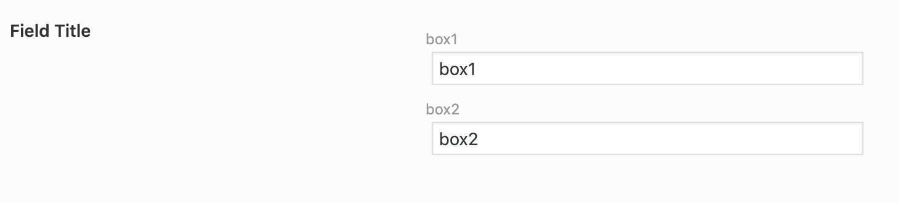
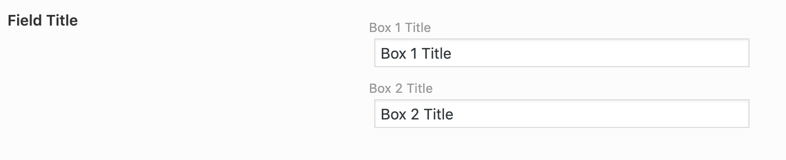

# Text

The Text field accepts any form of text and optionally validates the text before saving the value.

<span style="display:block;text-align:center"></span>

::: warning Table of Contents
[[toc]]
:::

<style>

</style>

## Arguments

|Name|Type|Default|Description|
|--- |--- |--- |--- |
|type|string|`text`|Value identifying the field type.|
|placeholder|string/array||Text to display inside the input when a value is not present.|
|autocomplete|boolean||If set to `false`, the autocomplete attribute will be set to `off`.|
|readonly|string||If set to `true`, the readonly attribute will be set to `readonly`.|

::: tip Also See
- [Global Field Arguments](../configuration/fields/arguments.md)
- [Using the `attributes` Argument](../configuration/fields/attributes.md)
- [Using the `data` Argument](../configuration/fields/data.md)
- [Using the `compiler` Argument](../configuration/fields/compiler.md)
- [Using the `output_variables` Argument](../configuration/fields/output-variables.md)
- [Using the `permissions` Argument](../configuration/fields/permissions.md)
- [Using the `required` Argument](../configuration/fields/required.md)
- [Using the `validate` Argument](../configuration/fields/validate.md)
:::

## Build Config
<script>
import builder from './text.json';
export default {
  data () {
      return {
          builder: builder,
          defaults: {}
      };
  }
}
</script>
<builder :builder_json="builder" :builder_defaults="defaults" />

## Example Usage
This example in based on the example usage provided above. Be sure to change `$redux_demo` to the value you specified in 
your [opt_name](../configuration/global_arguments.md#opt-name) argument.

```php
// Using the Redux API
echo Redux::getOption( 'OPT_NAME', 'FIELD_ID', 'DEFAULT_VALUE' );

// Using the global argment
global $redux_demo; // Same as your opt_name
echo $redux_demo['FIELD_ID'];
```


## Using the `data` Argument Manually
This argument serves two purposes with the text field. First, it works like any other [data](../configuration/fields/data.md) argument.
Meaning it can populate the field with WordPress data. Second, it allows a user to pass single array or a multi-dimensional array 
to output a number of text fields.

::: danger TAKE NOTE
The "value" portion of the data array will also be set as the default value if the field has no value stored. The key 
portion will become the ID by which it is stored under the field ID.
:::


::: tip USING WITH the <code>placeholder</code> Arg
When defined with an array, the placeholder argument can also be used as long as the IDs match between the `data` and `placeholder` arrays.
:::

#### Simple Array

<span style="display:block;text-align:center"></span>

```php
Redux::set_field( 'OPT_NAME', 'SECTION_ID', array( 
    'id' => 'FIELD_ID',
    'type' => 'text',
    'data' => array(
        'box1',
        'box2',
    )
) );
```

**Example Output**
```php
array(
    'box1',
    'box2'
)
```

#### Multi-Dimensional Array
<span style="display:block;text-align:center"></span>
```php
Redux::set_field( 'OPT_NAME', 'SECTION_ID', array( 
    'id' => 'FIELD_ID',
    'type' => 'text',
    'data' => array(
        'box1' => 'Box 1 Title',
        'box2' => 'Box 2 Title',
    )
) );
```

**Example Output**
```php
array(
    'box1' => 'Box 1 Title',
    'box2' => 'Box 2 Title' 
)
```

