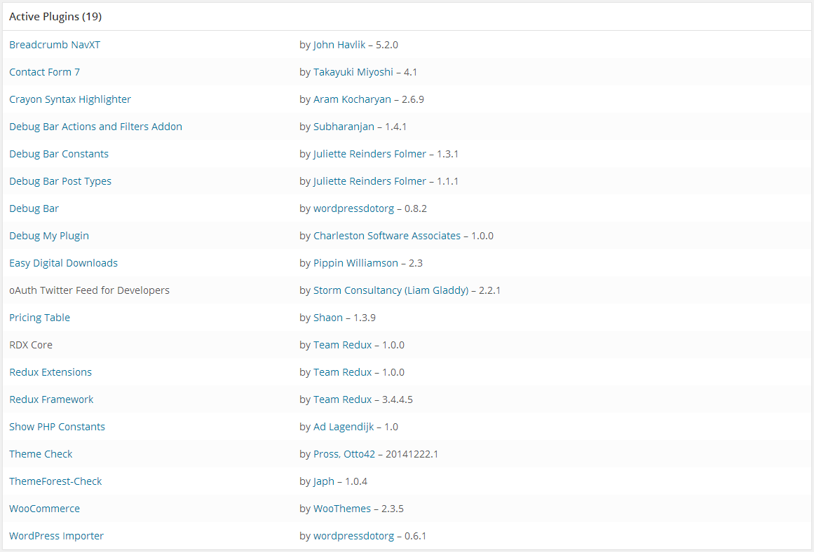

# Understanding The Health Status Report
The Redux Framework System Status report is a vital tool used in troubleshoot issues with your site. With a wide 
variety of sections and fields, software versions, server settings, and WordPress configuration, all may be checked in a 
moment’s notice.

The System Status report is also the best way that the Redux Support Team can help you.  Before opening a ticket, be 
sure to add your settings and check to see if you can troubleshoot an issue with the items below.

::: warning Table of Contents
[[toc]]
:::

## WordPress Environment
This section provides general information about your site, your WordPress installation, and the features you have enabled.

|Field Name|Description|Example|
|--- |--- |--- |
|Home URL|The URL of your site's homepage.|http://example.com|
|Site URL|The root URL of your site.|http://example.com|
|Redux Version|The version of Redux Framework installed on your site.|3.4.4.5|
|Redux Data Directory Writable|Whether the Redux data directory is writable, and its location.|/srv/www/wp-content/uploads/redux/|
|WP Version|The version of WordPress installed on your site.|3.4.1|
|WP Multisite|Whether you have WordPress Multisite enabled.|-|
|Permalink Structure|The WordPress permalink structure set in Settings->Permalinks.|/%postname%/|
|Front Page Display|The sitting to display "Latest Posts" or "Static Pages" as set in Settings->Reading.|posts|
|Front Page|The name of the page used as the "Front Page" of the site.  This information is displayed only when Front Page Display is set to pages.|
|Posts Page|The name of the page used as the "Post Page" of the site.  This information is displayed only when Front Page Display is set to pages.|
|WP Memory Limit|The maximum amount of memory (RAM) that your site can use at one time. Learn how to increase this limit here.|64 MB|
|Database Table Prefix|Displays the length of the WordPress database table prefix, and whether it falls into acceptable parameters.|Length: 3 - Status: Acceptable|
|WP Debug Mode|Displays whether WordPress is in Debug Mode.|-|
|Language|The current language used by WordPress. Default = English|en_US|

## Browser
This entry provides general information about your web browser.

|Field Name|Description|Example|
|--- |--- |--- |
|Browser Info|The complete User Agent string of the browser viewing the System Status report.|Platform: Windows Browser Name: Chrome Browser Version: 41.0.2272.101 User Agent String: Mozilla/5.0 (Windows NT 5.2; WOW 64) AppleWebKit/537.36 (KHTML, like Gecko) Chrome/41.0.2272.101 Safari/537.36|

## Server Environment
This section provides general information about your server.

|Field Name|Description|Example|
|--- |--- |--- |
|Server Info|Information about the web server that is currently hosting your site.|Apache/2.4.7 (Win32) OpenSSL/1.0.1e PHP/5.5.9|
|PHP Version|The version of PHP installed on your hosting server.|5.5.6|
|PHP Memory Limit|The maximum amount of memory in bytes that a script is allowed to allocate.|256 MB|
|PHP Post Max Size|The largest filesize that can be contained in one post.|8 MB|
|PHP Time Limit|The amount of time (in seconds) that your site will spend on a single operation before timing out (to avoid server lockups)|300|
|PHP Max Input Vars|The maximum number of variables your server can use for a single function to avoid overloads.|1000|
|PHP Display Errors|Determines whether errors should be printed to the screen as part of the output or if they should be hidden from the user.|-|
|SUHOSIN Installed|Suhosin is an advanced protection system for PHP installations. It was designed to protect your servers on the one hand against a number of well known problems in PHP applications and on the other hand against potential unknown vulnerabilities within these applications or the PHP core itself.  If enabled on your server, Suhosin may need to be configured to increase its data submission limits.|-|
|MySQL Version|The version of MySQL installed on your hosting server.|5.5.32|
|Max Upload Size|The largest filesize that can be uploaded to your WordPress installation.|8 MB|
|Default Time Zone is UTC|Whether the timezone for your server is UTC.|√|
|fsockopen/cURL|Payment gateways can use cURL to communicate with remote servers to authorize payments, other plugins may also use it when communicating with remote services.|√|
|SOAP Client|Some webservices like shipping use SOAP to get information from remote servers, for example, live shipping quotes from FedEx require SOAP to be installed.|√|
|DOM Document|HTML/Multipart Emails use DOMDocument to generate inline CSS in templates.|√|
|GZIP|GZip (gzopen) is used to open the GEOIP database from MaxMind.|√|
|Remote POST|PayPal uses this method of commnuicating when sending back transaction information. See the wp_remote_post Codex page for more information.|√|
|Remote GET|Redux Framework may use this method of communication when checking for updates.|√|

## Active Plugins
This section displays all the active plugins installed on your site. From this area, you can see the current version 
numbers of your plugins.

## Redux Instances
This section displays all the active instances of Redux Framework on your site. This information may be invaluable in 
detecting collisions with other developers who use Redux in their projects. Multiple instances could be listed, depending 
on if and how many plugins on your site use Redux Framework.

|Field Name|Description|Example|
|--- |--- |--- |
|opt_name|The opt_name variable set in the specified instance of Redux.|redux_demo|
|global_variable|The global_variable variable set in the specified instance of Redux.|redux_demo|
|dev_mode|Displays whether or not developer mode is enabled for the specified instance of Redux.|√|
|ajax_save|Displays whether or not AJAX based saving is enabled for the specified instance of Redux.|√|
|page_slug|The specified string that comprises the name of the options panel for the specified instance of Redux.|redux_options|
|page_permissions|The minimum permission setting required to view the options panel for the specified instance of Redux.|manage_options|
|menu_type|Variable sets whether or not the menu is displayed as an admin menu item in the specified instance of Redux.|menu|
|page_parent|Variable sets where the options menu will be placed on the WordPress admin sidebar for the specified instance of Redux.|themes.php|
|compiler|Flag setting the compiler option for the specified instance of Redux.|√|
|output|Indicates if output flag for globally shutting off all CSS output is enabled for the specified instance of Redux.|√|
|output_tag|The output_tag variable sets whether or not dynamic CSS will be generated for the customizer and Google fonts for this instance of Redux.|√|
|template_path|The full directory path to custom template files for this instance of Redux.  This data is only displayed if the template_path argument is set.|/srv/www/wp-content/themes//redux/templates|
|Templates|A list of custom templates used and their versions.  This data is only displayed if the template_path argument is set and templates are installed.|`/admin/templates/container.tpl.php`,  `/admin/templates/content.tpl.php`,  `/admin/templates/footer.tpl.php`,  `/admin/templates/header.tpl.php`,  `/admin/templates/header_stickybar.tpl.php`,  `/admin/templates/menu_container.tpl.php`|
|Extensions|A list of installed Redux Framework extensions and their versions.  This information is only displayed if extensions are installed.|Widget Areas - 1.0.0 Social Profiles - 1.0.2 Search - 1.0.0 Multi Media - 1.0.0 Metaboxes - 1.3.1 Js Button - 1.0.1 Custom Fonts - 1.0.1 Color Scheme - 2.1.6|

## Theme
This section displays valuable information about the current theme running on your installation. Typically, this could be 
one of the more problematic areas of a site – as there is no standard on what themes should and shouldn’t do.

|Field Name|Description|Example|
|--- |--- |--- |
|Name|The name of the current active theme.|HelpBase|
|Version|The installed version of the current active theme.|1.0.0|
|Author URL|The developer or plugin’s URL|http://www.rdx.io|
|Child Theme|Displays whether the active theme is a child theme, and what the parent theme is.|x|
|Parent Theme Name|The name of the current parent theme.  This information is displayed only f the current theme is a child theme.|HelpBase (child theme)|
|Parent Theme Version|The installed version of the parent theme.  This information is displayed only f the current theme is a child theme.|1.0.0|
|Parent Theme Author URL|The parent's theme's developer or URL.  This information is displayed only f the current theme is a child theme.|http://www.rdx.io|
