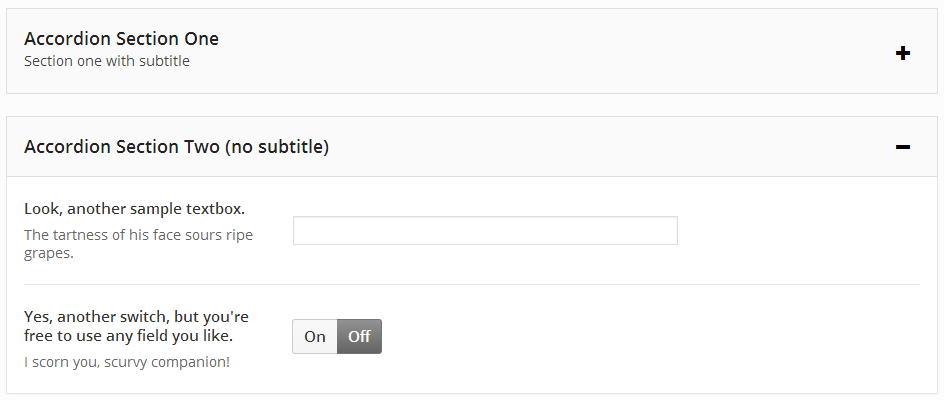

# Accordion <Badge text="field" type="warn"/>

The Accordion extension is an improved way to group like items in your options panel, inside a collapsible accordion 
field.  Such a feature comes in handy when a given options panel has many, many items that don't need to be shown 
simultaneously. 

<span style="display:block;text-align:center"></span>

::: warning Table of Contents
[[toc]]
:::

::: tip Getting Started
To understand how to use extensions, you should read this article on [Using Extensions](../guides/basics-using-extensions.md).
 To shortcut the process, you can use the [Redux Build](http://build.redux.io/) site. Please be aware that a working 
 knowledge of PHP and CSS is required to properly use this extension. Should you not be familiar with one or the other 
 (or both), please refer to the following guides to get you started: 
 [Getting Started with PHP](http://www.php.net/manual/en/tutorial.php), 
 [CSS Introduction](http://www.w3schools.com/css/css_intro.asp).
:::

Arguments
-----
|Name|Type|Default|Description|
|--- |--- |--- |--- |
|type|string|`accordion`|Value identifying the field type.|
|id|string||Unique ID identifying the field. Must be different from all other field IDs.|
|title|string||Displays title of the field.|
|subtitle|string||Subtitle display of the field, situated beneath the title.|
|class|string||Appends any number of classes to the field's class attribute.|
|position|string||Either start or end, depending on whether the array begins or ends the accordion block.  See Example Declaration below.|
|open|boolean|false|If set to true, accordion will be open. If set to false, accordion will be closed by default.|
|open-icon|string|el-plus|The Elusive Icon to show when the accordion is closed (to be opened).  At this time, only Elusive Icons are supported.|
|close-icon|string|el-minus|The Elusive Icon to show when the accordion is open (to be closed).  At this time, only Elusive Icons are supported.|

::: tip Also See
- [Using the `compiler` Argument](../configuration/argument-compiler.md)
- [Using the `hints` Argument](../configuration/argument-hints.md)
- [Using the `permissions` Argument](../configuration/argument-permissions.md)
- [Using the `required` Argument](../configuration/argument-required.md)
:::

## Example Declaration

The following example in included with the Accordion extension package.

::: danger NOTE
Each Accordion block MUST have an opening array with the `position` argument set to `start`, AND a closing array with the `position` argument set to `end`. Any fields you wish to display inside the accordion block would be added between the `start` and `end` arrays.
:::

```php
// First Accordion
$fields = array(
    array(
        'id'        => 'opt-accordion-begin-1',
        'type'      => 'accordion',
        'title'     => 'Accordion Section One',
        'subtitle'  => 'Section one with subtitle',
        'position'  => 'start',    ),
    ),
        array(
            'id'       => 'opt-blank-text-1',
            'type'     => 'text',
            'title'    => 'Textbox for some noble purpose.',
            'subtitle' => 'Frailty, thy name is woman!'
        ),
        array(
            'id'       => 'opt-blank-text-2',
            'type'     => 'switch',
            'title'    => 'Switch, for some other important task!',
            'subtitle' => 'Physician, heal thyself!'
        ),             
    array(
        'id'        => 'opt-accordion-end-1',
        'type'      => 'accordion',
        'position'  => 'end'
    ),
    
    // Second Accordion
    array(
        'id'       => 'opt-accordion-begin-2',
        'type'     => 'accordion',
        'title'    => 'Accordion Section Two (no subtitle)',
        'position'  => 'start',
    ),
        array(
            'id'       => 'opt-blank-text-3',
            'type'     => 'text',
            'title'    => 'Look, another sample textbox.',
            'subtitle' => 'The tartness of his face sours ripe grapes.'
        ),
        array(
            'id'       => 'opt-blank-text-4',
            'type'     => 'switch',
            'title'    => 'Yes, another switch, but you\'re free to use any field you like.',
            'subtitle' => 'I scorn you, scurvy companion!'
        ),             
    array(
        'id'        => 'opt-accordion-end-2',
        'type'      => 'accordion',
        'position'  => 'end'
    )
);
```

The Accordion field has no return values for use on the front end of your site. It is simply a tool to easier block and manage multiple options, providing your user for a cleaner and more appealing visual experience.