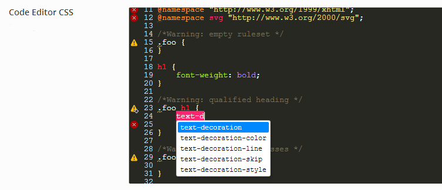
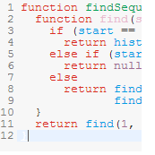

# CodeMirror - Advanced Code Editor <Badge text="field" type="warn"/>

::: danger DEPRECATED
This extension has been deprecated due to lack of support from the original developer.
:::

[CodeMirror](http://codemirror.net/) is a versatile text editor implemented in JavaScript for the browser. It is 
specialized for editing code, and comes with a number of language modes and addons that implement more advanced editing 
functionality.

<span style="display:block;text-align:center"></span>

::: warning Table of Contents
[[toc]]
:::

::: tip Getting Started
To understand how to use extensions, you should read this article on [Using Extensions](../guides/basics/using-extensions.md).
 To shortcut the process, you can use the [Redux Build](http://build.redux.io/) site. Please be aware that a working 
 knowledge of PHP and CSS is required to properly use this extension. Should you not be familiar with one or the other 
 (or both), please refer to the following guides to get you started: 
 [Getting Started with PHP](http://www.php.net/manual/en/tutorial.php), 
 [CSS Introduction](http://www.w3schools.com/css/css_intro.asp).
:::

## Features

- Support for over 60 languages out of the box
- A powerful, composable language mode system
- Autocompletion (XML)
- Code folding
- Configurable keybindings
- Vim and Emacs bindings
- Search and replace interface
- Bracket and tag matching
- Support for split views
- Linter integration
- Mixing font sizes and styles
- Various themes
- Able to resize to fit content
- Inline and block widgets
- Programmable gutters
- Making ranges of text styled, read-only, or atomic
- Bi-directional text support

Many other methods and addons...

## Browser support

The desktop versions of the following browsers, in standards mode (HTML5 recommended) are supported:

- Firefox version 3 and up
- Chrome any version
- Safari version 5.2 and up
- Internet Explorer version 8 and up
- Opera version 9 and up

Modern mobile browsers tend to partly work as the [official Codemirror documentation says](http://codemirror.net/#browsersupport).

## Basic Usage

The basic Codemirror Editor for Redux Framework is added like the other fields with these parameters:

```php
array(
    'id' => 'codemirror',
    'type' => "codemirror",
    'title' => __("Code Editor CSS", 'redux-framework-demo'),
    'compiler' => 'true',
    'subtitle' => __('Dummy Subtitle', 'redux-framework-demo'),
    'editor_options' => array(
        "mode" => array("css"),
        "addon" => array("foldcode-css","activeline"),
        "theme" => "monokai",
        "lint" => true,
        "hint" => true,
        "autohint" => true
    )
)
```

## Arguments
|Name|Type|Default|Description|
|--- |--- |--- |--- |
|type|string|`codemirror`|Value identifying the field type.|
|id|string||Unique ID identifying the field. Must be different from all other field IDs.|
|title|string||Display title of the option.|
|subtitle|string||Subtitle display of the option, situated beneath the title.|
|desc|string||Description of the option, appearing beneath the field control.|
|placeholder|string||Field descriptor, displayed inside of the field when no data is set.|
|compiler|boolean||Flag to set the compiler hook, or array of CSS selectors which passes dynamic CSS to the compiler hook.|
|editor_options|array||Sets codemirror options like field mode, theme, addons, lint, autocomplete, complete on demand (Ctrl+Space).|

::: tip Also See
- [Using the `compiler` Argument](../configuration/argument/compiler.md)
- [Using the `hints` Argument](../configuration/argument/hints.md)
- [Using the `permissions` Argument](../configuration/argument/permissions.md)
- [Using the `required` Argument](../configuration/argument/required.md)
:::

## Codemirror Editor Options

|Name|Type|Default|Description|
|--- |--- |--- |--- |
|mode|array||Mode(s) of the editor like CSS, Javascript, CoffeeScript, Markdown etc. For avaliable modes, see Language Modes section.|
|addon|array||Defines the editor’s addon(s) like search box implementation, selection marking, rulers etc. For available addons, refer to Add-ons section.|
|theme|string|`default`|Sets the theme of the editor.  See Themes below.|
|lint|boolean|false|Enables on-the-fly code lint checks like jshint, csslint etc. Not available for mixed modes like htmlmixed.|
|hint|boolean|false|Enables autocomplete feature. If autohint is set to false, this feature triggers on `Ctrl + Space` key combination. If not, it shows the autocomplete box as you type.|
|autohint|boolean|false|Enables showing the autocomplete box as you type.|
|lineNumbers|boolean|true|Enables the line number gutter display.|


## Language Modes

This is a list of every mode in the distribution. Each mode lives in a subdirectory of the mode/ directory, and 
typically defines a single JavaScript file that implements the mode. Loading such file will make the language available 
to CodeMirror, through the mode option. This extension has the autoloading feature of those files, which searches for 
defined mode directory and autoloads neccessary files.

|||||
|--- |--- |--- |--- |
|APL (mode:apl)|Asterisk dialplan (mode:asterisk)|C, C++, C# (mode:clike)|Clojure (mode:clojure)|
|COBOL (mode:cobol)|CoffeeScript (mode:coffeescript)|Common Lisp (mode:commonlisp)|CSS (mode:css)|
|Cython (mode:phyton)|D (mode:d)|diff (mode:diff)|DTD (mode:dtd)|
|ECL (mode:ecl)|Eiffel (mode:eiffel)|Erlang (mode:erlang)|Fortran (mode:fortran)|
|F# (mode:mllike)|Gas (AT&T-style assembly) (mode:gas)|Gherkin (mode:gherkin)|Go (mode:go)|
|Groovy (mode:groovy)|HAML (mode:haml)|Haskell (mode:haskell)|Haxe (mode:haxe)|
|HTTP (mode:http)|Java (mode:clike)|Jade (mode:jade)|JavaScript (mode:javascript)|
|Jinja2 (mode:jinja2)|Julia (mode:julia)|LESS (mode:less)|LiveScript (mode:livescript)|
|Markdown (GitHub-flavour) (mode:markdown)|mIRC (mode:mirc)|Nginx (mode:nginx)|NTriples (mode:ntriples)|
|OCaml (mode:mllike)|Octave (MATLAB) (mode:octave)|Pascal (mode:pascal)|PEG.js (mode:pegjs)|
|Perl (mode:perl)|PHP (mode:php)|Pig Latin (mode:pig)|Properties files (mode:properties)|
|Puppet (mode:puppet)|Python (mode:phyton)|Q (mode:q)|R (mode:r)|
|RPM spec and changelog (mode:rpm)|reStructuredText (mode:rst)|Ruby (mode:ruby)|Rust (mode:rust)|
|Sass (mode:sass)|Scala (mode:clike)|Scheme (mode:scheme)|SCSS (mode:css)|
|Shell (mode:shell)|Sieve (mode:sieve)|Smalltalk (mode:smalltalk)|Smarty (mode:smarty)|
|Smarty/HTML mixed (mode:smartymixed)|Solr (mode:solr)|SQL (several dialects) (mode:sql)|SPARQL (mode:sparql)|
|sTeX, LaTeX (mode:stex)|Tcl (mode:tcl)|Tiddlywiki (mode:tiddlywiki)|Tiki wiki (mode:tiki)|
|TOML (mode:toml)|Turtle (mode:turtle)|VB.NET (mode:vb)|VBScript (mode:vbscript)|
|Velocity (mode:velocity)|Verilog (mode:verilog)|XML/HTML (mode:xml)|XQuery (mode:xquery)||
|YAML (mode:yaml)|Z80 (mode:z80)|||


## Themes

|||||
|--- |--- |--- |--- |
|<br />3024-day|<br />3024-night|<br />ambiance|<br/>base16-dark|
|<br />base16-light|<br />blackboard|<br />cobalt|<br />eclipse|
|<br />elegant|<br />erlang-dark|<br />lesser-dark|<br />mbo|
|<br />mdn-like|<br />midnight|<br />monokai|<br />neat|
|<br />night|<br />paraiso-dark|<br />paraiso-light||

## Add-ons

|||
|--- |--- |
|activeline|Displays active line in different style. [Demo page for this addon](http://codemirror.net/demo/activeline.html) in Codemirror Official Site.|
|closebrackets|Auto closes `[]`,`{}`,`''`,`""` brackets inside the editor when typed. [Demo page for this addon](http://codemirror.net/demo/closebrackets.html) in Codemirror Official Site.|
|closetag|Auto closes xml tags if the editor has an xml compatible mode like HTML. [Demo page for this addon](http://codemirror.net/demo/closetag.html) in Codemirror Official Site.|
|continuelist|If this add-on is active in the `markdown` mode, when user presses the `Enter` key while typing a markdown list, the editor automatically indents the new line to the markdown definition list’s left margin. [Demo page for this addon](http://codemirror.net/mode/markdown/index.html) in Codemirror Official Site.|
|foldcode-comment|Adds folding feature to gutter for multiline comments.|
|foldcode-css|Adds folding feature to gutter for CSS brackets.|
|foldcode-html|Adds folding feature to gutter for matched XML like tags.[Demo page for this addon](http://codemirror.net/demo/folding.html) in Codemirror Official Site.|
|foldcode-indent|Adds folding feature to gutter for the lines that have the same indent level.|
|foldcode-js|Adds folding feature to gutter curly brace matches in Javascript (and likes). [Demo page for this addon](http://codemirror.net/demo/folding.html) in Codemirror Official Site.|
|foldcode-markdown|Adds folding feature to gutter for markdown mode. [Demo page for this addon](http://codemirror.net/demo/folding.html) in Codemirror Official Site.|
|fullscreen|Adds a fullscreen feature which will switch to fullscreen when `F11` key is pressed inside the editor. [Demo page for this addon](http://codemirror.net/demo/fullscreen.html) in Codemirror Official Site.|
|markselection|Adds a different styling to the selected text in the editor. [Demo page for this addon](http://codemirror.net/demo/markselection.html) in Codemirror Official Site.|
|matchbrackets|Highlights the matching bracket couples mentioned in `closebrackets` addon when clicked on one of them inside the editor.|
|matchhighlights|Highlights the same words as which the user selects in the editor. [Demo page for this addon](http://codemirror.net/demo/matchhighlighter.html) in Codemirror Official Site.|
|matchtags|Highlights the same tags as the tag that user selected. [Demo page for this addon](http://codemirror.net/demo/matchtags.html) in Codemirror Official Site.|
|placeholder|if a `placeholder` property is defined in the field’s property list (outside `editor_options` array), this text will be shown in the editor as a placeholder text for the user. [Demo page for this addon](http://codemirror.net/demo/placeholder.html) in Codemirror Official Site.|
|rulers|Displays an user-defined ruler on the editor. If you wonder how to define a ruler set, have a look at `addons/display/default-ruler.js` file, and feel free to modify that script to suit your needs. Also the styling resides in `addons/display/default-rulers.css` file. [Demo page for this addon](http://codemirror.net/demo/rulers.html) in Codemirror Official Site.|
|search|Adds a function to the key `Ctrl+F` to show a dialog for searching the editor content. [Demo page for this addon](http://codemirror.net/demo/search.html) in Codemirror Official Site.|
|trailingspace|Styles the trailing spaces with the style defined in `addons/edit/trailingspace.css`. [Demo page for this addon](http://codemirror.net/demo/trailingspace.html) in Codemirror Official Site.|
