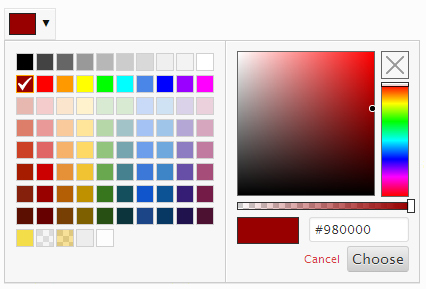
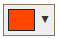
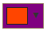

# Color Schemes <Badge text="field" type="warn"/>

The Redux Color Schemes extension is a new way to take control over the color layout of your theme.  Instead of using 
individual color pickers to design the color layout of your theme, set them all up in one simple, easy-to-use field!   
In addition to choosing any color, this extension also offers a per color alpha channel, the option to select no color, 
and the ability to save and recall entire user designed color schemes.  This comes in handy should you wish to give your 
users the ability to change theme colors for various holiday or special occasions... or even if they want shake things up 
every now and then.

<span style="display:block;text-align:center"></span>

::: warning Table of Contents
[[toc]]
:::

::: tip Getting Started
To understand how to use extensions, you should read this article on [Using Extensions](../guides/basics/using-extensions.md).
 To shortcut the process, you can use the [Redux Build](http://build.redux.io/) site. Please be aware that a working 
 knowledge of PHP and CSS is required to properly use this extension. Should you not be familiar with one or the other 
 (or both), please refer to the following guides to get you started: 
 [Getting Started with PHP](http://www.php.net/manual/en/tutorial.php), 
 [CSS Introduction](http://www.w3schools.com/css/css_intro.asp).
:::

## Arguments
Array of individual arrays that set the individual color pickers.  See 'Creating a Color Scheme Layout' below.

|Name|Type|Default|Description|
|--- |--- |--- |--- |
|type|string|`color_scheme`|Value identifying the field type.|
|id|string||Unique ID identifying the field. Must be different from all other field IDs.|
|title|string||Displays title of the field.|
|subtitle|string||Subtitle display of the field, situated beneath the title.|
|desc|string||Description of the field, appearing beneath the field control.|
|class|string||Appends any number of classes to the field's class attribute.|
|compiler|bool|false|Flag to run the compiler hook or array.  With this extension, the value only need be true or false.  See 'Outputting the Color Values' below.|
|output|bool|false|Flag to output dynamically generate CSS.  With this extension, the value only need be true or false.  See 'Outputting the Color Values' below.|
|options|array||Array of options that sets the behavior of the color picker.  See `Color Picker Options` below.|
|output_transparent|bool|false|Flag that sets whether or not a blank color outputs as an empty space or as the string `transparent`.|
|no_compiler_output|bool|false|Flag that determines whether or not CSS will be outwith with the compiler flag set to `true`.  Useful when only desiring to fire the compiler without any output.|
|groups|array||Array of color group categories to which color pickers will be grouped. See 'Creating Color Groupings' below.|
|accordion|bool|true|Flag to set the accordion folding for color groups.|
|simple|bool|false|Flag to set the display of the scheme saving options.  See 'Using Schemes' below.|
|hint|array||Array containing the `content` and optional `title` arguments for the hint tooltip. More info|

::: tip Also See
- [Using the `compiler` Argument](../configuration/argument/compiler.md)
- [Using the `hints` Argument](../configuration/argument/hints.md)
- [Using the `output` Argument](../guide/the-output-argument.md)
- [Using the `permissions` Argument](../configuration/argument/permissions.md)
- [Using the `required` Argument](../configuration/argument/required.md)
:::

## Color Picker Options

|Name|Type|Default|Description|
|--- |--- |--- |--- |
|show_input|bool|true|Flag to allow free form typing input.|
|show_initial|bool|true|Flag to set the display of the color initially set when opening the color picker.|
|show_alpha|bool|true|Flag to set the alpha transparency selector.|
|show_palette|bool|true|Flag to set the display of the color picker's color palette.|
|show_palette_only|bool|false|Flag to display the color palette only, and nothing else.|
|show_selection_palette|bool|true|Flag to display a palette of previously selected colors.|
|max_palette_size|int|10|Integer value setting the number of colors to display horizontally in the color palette.|
|allow_empty|bool|true|Flag to set the display of of 'clear' button, removing the color value.|
|clickout_fires_change|bool|false|Flag that determines if clicking outside the color picker forces a color change.|
|choose_text|string|'Choose'|String to display for the color picker Choose button.|
|cancel_text|string|'Cancel'|String to display for the color picker Cancel button.|
|show_buttons|bool|true|Flag that sets the display of the Choose and Cancel buttons.|
|use_extended_classes|bool|false|Flag enabled the use of CSS Container and Replacer classes.  See 'Extended Classes' below.|
|palette|array||Individual arrays color values.  See 'Color Palettes' below.|


## Creating a Color Groupings
To sort color pickers into a particular groups, we must first define the group categories as an array in the `groups` argument.  Groups are set as key/pairs.  The key represents the group name.  The value is an array where the following settings may be applied:

|Name|Type|Default|Description|
|--- |--- |--- |--- |
|desc|string||Optional.  The description to display beneath the color grouping's name.|
|hidden|bool|false|Optional.  Flag setting the visibility of the color grouping.  This is useful in event you'd like to hide certain group under certain circumstances while retaining the color data in the database.|
|accordion_open|bool|false|Optional.  Flag to set whether or not the group's accordion is open or closed by default.|


Alternatively, set the value of the group key/pair to a string to indicate the description. In doing so, the `hidden` and `accordion_open` will be set to their default values. See the example below.

Once the groups array is set, the group name will be used to pass as an argument into the color selector (explained below).

The following example demonstrates how to create three different group categories in which color pickers may be assigned to.

```php
$array = array(
  'groups'   => array(
    'Header' => array(
      'desc'              => 'Set header and nav colors here. (Group open by default)',
      'hidden'            => false,
      'accordion_open'    => true
    ),                    
    'Body'   => 'Set body and content colors here.',
    'Widget' => '',
    ''       => 'These colors are not asigned to any group.'
  )
);
```

Three different group categories have been specified. The fourth key/pair above demonstrates how to optionally set a description for color selectors that are grouped together, but have no group name.

## Changing the Accordion Icons

Should you wish to use different icons for the group accordions, the may be changed via filter hooks.  Please remember to substitute <opt_name> with the opt_name string of your project.  See the example below.

The open icon filter tag is: `'redux/extension/color_scheme/' . <opt_name> . '/icon/open'`
The close icon filter tag is: `'redux/extension/color_scheme/' . <opt_name> . '/icon/close'`

::: warning NOTE
At this time, <a href="http://elusiveicons.com/" target="_blank">Elusive Icon</a>s is the only integrated icon set.
::: 

```php
// Remember to change this variable to the opt_name
// of your project.
$opt_name = 'redux_demo';

// Change the Open Icon
add_filter ('redux/extension/color_scheme/' . $opt_name . '/icon/open', 'redux_change_open_icon');

function redux_change_open_icon($value) {
    $value = 'el-plus'

    return $value;
}

// Change the Close Icon
add_filter ('redux/extension/color_scheme/' . $opt_name . '/icon/close', 'redux_change_close_icon');

function redux_change_close_icon($value) {
    $value = 'el-minus'

    return $value;
}
```

## Creating a Color Scheme Layout

The beauty of the color schemes field is the ability to assign a color to basically any CSS selector that accepts a color value.  It's ideal to create your CSS layout first, to determine initial CSS classes, IDs, selectors, and values used throughout your theme.  Once that has been accomplished, it's as easy as assigning them to an individual color selector.

Let's examine the arguments for each color selector first.  These arrays are placed inside the `default` argument of the color scheme field array.

|Name|Type|Default|Description|
|--- |--- |--- |--- |
|id|string||Unique ID for the color selector.  This must be different from other color selector IDs.|
|title|string||The text that will appear below the color selector.|
|color|string||Hex string of the default color for the color selector.|
|alpha|float|1|Float value of the default alpha value.  Value must be a decimal value between `0` and `1`.|
|selector|string||CSS class or ID to which the color will be used with.|
|mode|string|'color'|CSS mode in which the color is assigned to.|
|important|bool|false|Flag to set the CSS `!important` value.|
|group|string||String of a group name set in the group array.  If left blank, or using the name of a group that does not exist, the color picker will appear in a nameless group.|


A very basic default example would look like this:
```php
array(
    'id'            => 'opt-color-scheme',
    'type'          => 'color_scheme',
    'title'         => 'Color Schemes',
    'subtitle'      => 'Save and load color schemes',
    'output'        => true,
    'compiler'      => true,
    'simple'        => false,
    'default'       => array(
        array(
            'id'        => 'body-text', // ID
            'title'     => 'body text', // Display text
            'color'     => '#fdfdfd',   // Default colour
            'alpha'     => 1,           // Default alpha
            'selector'  => 'body',      // CSS selector
            'mode'      => 'color',     // CSS mode
            'important' => true         // CSS important
            'group'     => 'Body'       // Optional group name
        ),
        array(
            'id'        => 'body-background',
            'title'     => 'body background',
            'color'     => '#ededed', 
            'alpha'     => .5,
            'selector'  => 'body',
            'mode'      => 'background-color',
            'important' => false
            'group'     => 'Body'
        ),
    )
);    
```

Note that we've assigned these selectors to the 'Body' group.  These selectors will be rendered underneath the group with the Body label.  If the `group` argument is omitted, the color selectors will appear in a group without a name.

This example assumes your CSS file contains a declaration for `body` and said declaration has been properly coded into your theme.

```css
body {
    color: #fdfdfd; 
    background-color: #ededed;
}
```

As you can see, each color selector's `selector` argument is assigned to `body`, the exact same declared in the CSS file. The `mode` argument of the first color selector is assigned to the `color` element, while the second color selector is assigned to the `background-color` element. This is how the chosen colors sync up with your theme's CSS file. The same may be repeated for virtually any CSS selector that supports a color element.

## Outputting the Color Values

Now it's time to determine how to output the colors your users will choose and save. There are three ways to accomplish this. The first is to use the Redux options array variable followed by the color selector id, just as you might for any other Redux field. Using the example above, outputting the the body color and background color would go as follows (Please remember to replace `redux_demo` with your own `<a href="/redux-framework/arguments/opt_name" title="opt_name">opt_name</a>` argument):

```php
global $redux_demo;

echo 'body color: '            . $redux_demo['opt-color-scheme']['body-text']['color'];
echo 'body alpha: '            . $redux_demo['opt-color-scheme']['body-text']['alpha'];
echo 'body rgba: '             . $redux_demo['opt-color-scheme']['body-text']['rgba'];
echo 'body background color: ' . $redux_demo['opt-color-scheme']['body-background']['color'];
echo 'body background alpha: ' . $redux_demo['opt-color-scheme']['body-background']['alpha'];
echo 'body background rgba: '  . $redux_demo['opt-color-scheme']['body-background']['rgba'];

// Outputs:
// body color: #fdfdfd
// body alpha: 1
// body rgba: rgba(253, 253, 253, 1)
// body background color: #ededed
// body background alpha: .5
// body background rgba: rgba(237, 237, 237, 0.5)

// Should they be needed, these variables may also be outputted:
echo 'scheme name: '    . $redux_demo['opt-color-scheme']['color_scheme_name'];
echo 'body title: '     . $redux_demo['opt-color-scheme']['body-text']['title'];
echo 'body selector: '  . $redux_demo['opt-color-scheme']['body-text']['selector'];
echo 'body mode: '      . $redux_demo['opt-color-scheme']['body-text']['mode'];
echo 'body important: ' . $redux_demo['opt-color-scheme']['body-text']['important'];
echo 'body group: '     . $redux_demo['opt-color-scheme']['body-text']['group'];

// Outputs:
// scheme name: Default
// body title: body text
// body selector: body
// body mode: color
// body important: true
// body group: Body

```

While this is the most basic method, it can also become quite cumbersome should such calls need to be used multiple times throughout your theme. The second way, a more efficient way is to set the `output` argument to true. Unlike the core Redux fields, this extension does not require the passing of any CSS selectors. All you need do is set the argument to true and the full CSS of selectors, elements, and values will be dynamically outputted within your theme's HTML.

The final method is to use the <a href="/redux-framework/advanced/updating-a-css-file-dynamically" title="Updating a CSS File Dynamically">CSS compiler</a> included with the Redux Framework. Again, the core Redux fields normally accept an array of CSS selectors to send to the compiler. This extension requires you only set the `compiler` argument to true. It will take care of the rest, delivering all the field's selector values, elements, and values in one string. What you do with that data via the compiler is up to you.

## Using Schemes
The color scheme extension may be displayed in two different modes: Default mode which displays controls for saving, deleting, importing and exporting schemes, or simple mode which displays an array of color blocks and nothing else. The following five features are only applicable when not using simple mode. In simple mode, the user will be unable to save, delete, import or export schemes.

Please feel free to copy (and/or edit) these instructions for inclusion with your scheme documentation, so your users understand how the features work. We openly support the proper operation of the extension for the theme developer, but end users of your theme who contact us for 'how to' information will be directed to this page, or back to your support staff.

### Selecting Schemes
On first load, the color scheme extension installs the default theme based on the defaults settings set up in the default array of the color scheme field array. The default scheme is permanent and cannot be deleted, although changes can be made to it and saved with different values. Resetting the section or resetting all via the Redux options panel will reset any changes to your default settings.

Once new scheme layouts have been saved, they may be selected via the drop down select box. You must click <i>Save Changes</i> before the newly selected scheme will be available for use within your theme.

::: warning NOTE
Should you decide to make changes to your defaults in the color scheme field array, those changes will not be visible until the color scheme field is reset.
:::

### Adding Schemes
The easiest way to create a new scheme layout is to make any desired color changes to the default scheme, provide a new scheme name in the Name text box, then click <i>Add</i>. This will commit the new scheme to the database without affecting the color selection in the default scheme. Please bear in mind, even though the new scheme is selected in the drop down selector, it will not be applied to the theme until <i>Save Changes</i> is clicked.

### Deleting Schemes
To delete a scheme, select the theme to delete in the drop down selector, and click the <i>Delete</i> button. After verifying if you really want to delete the scheme, the extension will remove the scheme from the database and reset the scheme table to the Default scheme. It will also remove the deleted schemes settings from the theme and reset the theme colors to the default scheme.

### Exporting Schemes
Save a collection of schemes is as easy as clicking the <i>Export</i> button. Redux will download a JSON file of all scheme data to your hard drive (location may vary depending on how and where your browser downloads files). The file name will be in the following format: `redux_schemes_<opt_name>_<field-id>_<current-date>.json`.  It is <strong>strongly</strong> recommended that the contents of the export file <strong>not</strong> be edited unless whomever is editing the file is familiar with the <a href="http://www.w3schools.com/json/">JSON format</a>. Doing so could cause failure during import.

### Importing Schemes
To import a collection of schemes into the color scheme field, begin by clicking the <i>Import</i> button. An 'Open' dialog will appear on the screen, prompting for the selection of a file with the `.json` extension. Select a previously exported color scheme file from the computer and click <i>Open</i>. Redux will import the saved settings from the export file into the color scheme field. Once complete, the browser will refresh itself so the imported data will be properly displayed.

<strong>NOTE:</strong> Any existing color scheme settings will be overwritten.

## Extended Classes
Should the color selector and color picker popup styles not be to your liking, or should you want to match them with your theme, we've provided two classes, the `container` and `replacer` classes to make those changes. To activate these classes, the `use_extended_classes` argument in the `options` array must be set to `true`. On the next page load/refresh, the extension will add the `redux-color-schemes.css` file to your theme's directory. This is necessary as the extension must enqueue the file specifically. We cannot use the native `styles.css` as it does not enqueue in the options panel. Also note then setting `use_extended_classes` to false will automatically remove that CSS file.

Inside `redux-color-schemes.css` you will find two classes. `redux-colorpicker-container` and `redux-replacer-container`.

The Container class represent the color picker popup window, as shown below.

<span style="display:block;text-align:center"></span>

By adding CSS selectors and elements to the container class, it's overall look and feel may be manipulated to your liking. The following example demonstrates how to give the color picker container a purple background:

```css
.redux-colorpicker-container {
    background: purple;
}
```

<span style="display:block;text-align:center"></span>

The Replacer class represents the replacer element, or the color block:

<span style="display:block;text-align:center"></span>

Using the exact same method for the Container class, the same results are accomplished by adding CSS selectors and elements to the Replacer class. The following example would change the replacer element's background to purple:

```css
.redux-colorpicker-replacer {
    background: purple;    
}
```

<span style="display:block;text-align:center"></span>

## Color Palettes

Creating a custom palette for use within with color picker popup (container) requires setting a series of color arrays with string hex values within a single array. The Redux color scheme extension comes pre-programmed with the following palette.

```php
'palette' => array(
    array("#000000", "#434343", "#666666", "#999999", "#b7b7b7", "#cccccc", "#d9d9d9", "#efefef", "#f3f3f3", "#ffffff"),
    array("#980000", "#ff0000", "#ff9900", "#ffff00", "#00ff00", "#00ffff", "#4a86e8", "#0000ff", "#9900ff", "#ff00ff"),
    array("#e6b8af", "#f4cccc", "#fce5cd", "#fff2cc", "#d9ead3", "#d9ead3", "#c9daf8", "#cfe2f3", "#d9d2e9", "#ead1dc"),
    array("#dd7e6b", "#ea9999", "#f9cb9c", "#ffe599", "#b6d7a8", "#a2c4c9", "#a4c2f4", "#9fc5e8", "#b4a7d6", "#d5a6bd"),
    array("#cc4125", "#e06666", "#f6b26b", "#ffd966", "#93c47d", "#76a5af", "#6d9eeb", "#6fa8dc", "#8e7cc3", "#c27ba0"),
    array("#a61c00", "#cc0000", "#e69138", "#f1c232", "#6aa84f", "#45818e", "#3c78d8", "#3d85c6", "#674ea7", "#a64d79"),
    array("#85200c", "#990000", "#b45f06", "#bf9000", "#38761d", "#134f5c", "#1155cc", "#0b5394", "#351c75", "#741b47"),
    array("#5b0f00", "#660000", "#783f04", "#7f6000", "#274e13", "#0c343d", "#1c4587", "#073763", "#20124d", "#4c1130")
);
```

Here are some other example palettes to experiment with:

#### Gmail style

```php
'palette' => array(
    array("#000","#444","#666","#999","#ccc","#eee","#f3f3f3","#fff"),
    array("#f00","#f90","#ff0","#0f0","#0ff","#00f","#90f","#f0f"),
    array("#f4cccc","#fce5cd","#fff2cc","#d9ead3","#d0e0e3","#cfe2f3","#d9d2e9","#ead1dc"),
    array("#ea9999","#f9cb9c","#ffe599","#b6d7a8","#a2c4c9","#9fc5e8","#b4a7d6","#d5a6bd"),
    array("#e06666","#f6b26b","#ffd966","#93c47d","#76a5af","#6fa8dc","#8e7cc3","#c27ba0"),
    array("#c00","#e69138","#f1c232","#6aa84f","#45818e","#3d85c6","#674ea7","#a64d79"),
    array("#900","#b45f06","#bf9000","#38761d","#134f5c","#0b5394","#351c75","#741b47"),
    array("#600","#783f04","#7f6000","#274e13","#0c343d","#073763","#20124d","#4c1130"),
);
```

#### Snag-It Style

```php
'palette' => array(
    array("#ffffff", "#000000", "#c00000", "#f79646", "#f5f445", "#7fd13b", "#4bacc6", "#1f497d", "#8064a2", "#ff0000"),
    array("#f2f2f2", "#7f7f7f", "#f8d1d3", "#fdeada", "#fafdd7", "#e5f5d7", "#dbeef3", "#c6d9f0", "#e5e0ec", "#ffcc00"),
    array("#d7d7d7", "#595959", "#f2a3a7", "#fbd5b5", "#fbfaae", "#cbecb0", "#b7dde8", "#8db3e2", "#ccc1d9", "#ffff00"),
    array("#bebebe", "#414141", "#eb757b", "#fac08f", "#eef98e", "#b2e389", "#92cddc", "#548dd4", "#b2a2c7", "#00ff00"),
    array("#a3a3a3", "#2a2a2a", "#a3171e", "#e36c09", "#dede07", "#5ea226", "#31859b", "#17365d", "#5f497a", "#0000ff"),
    array("#7e7e7e", "#141414", "#6d0f14", "#974806", "#c0c00d", "#3f6c19", "#205867", "#0f243e", "#3f3151", "#9900ff")
);
```

#### Newton Style

```php
'palette' => array(
"#ffffff", "#000000", "#ff0000", "#ff8000", "#ffff00", "#008000", "#0000ff", "#4b0082", "#9400d3"
);
```

#### AOL Style

```php
'palette' => array(
    array("#ffffff", "#fff7de", "#ffffce", "#ffffbd", "#ffffd6", "#b5ff84", "#c6efde", "#efffff", "#efe7f7", "#dea5d6");
    array("#ded6c6", "#ffc6bd", "#ffe7b5", "#ffe7a5", "#efef7b", "#adf77b", "#5abd9c", "#a5d6f7", "#8494e7", "#ef7be7");
    array("#cec6b5", "#e78473", "#efad52", "#f7b500", "#efef9c", "#a5ff00", "#7bd6bd", "#a5d6de", "#8c5ae7", "#de6bce");
    array("#8c8473", "#ef0018", "#ef4210", "#f79400", "#ffff00", "#63d600", "#a5c684", "#5a63d6", "#7b52c6", "#c642ce");
    array("#736b63", "#d60039", "#d67310", "#f7844a", "#f7de00", "#429400", "#4a944a", "#4200ff", "#9c00de", "#a500c6");
    array("#39524a", "#b51821", "#944a08", "#a55229", "#8c8c00", "#318c00", "#429484", "#3100c6", "#523984", "#940084");
    array("#000000", "#940008", "#840008", "#ad2929", "#637321", "#296b00", "#29006b", "#21007b", "#52007b", "#84007b");
);
```

#### Old GMail Style

```php
'palette' => array(
    array("#ffffff", "#cecece", "#c6c6c6", "#9c9c9c", "#636363", "#313131", "#000000"),
    array("#ffcece", "#ff6363", "#ff0000", "#ce0000", "#9c0000", "#630000", "#310000"),
    array("#ffce9c", "#ff9c63", "#ff9c00", "#ff6300", "#ce6300", "#9c3100", "#633100"),
    array("#ffff9c", "#ffff63", "#ffce63", "#ffce31", "#ce9c31", "#9c6331", "#633131"),
    array("#ffffce", "#ffff31", "#ffff00", "#ffce00", "#9c9c00", "#636300", "#313100"),
    array("#9cff9c", "#63ff9c", "#31ff31", "#31ce00", "#009c00", "#006300", "#003100"),
    array("#9cffff", "#31ffff", "#63cece", "#00cece", "#319c9c", "#316363", "#003131"),
    array("#ceffff", "#63ffff", "#31ceff", "#3163ff", "#3131ff", "#00009c", "#000063"),
    array("#ceceff", "#9c9cff", "#6363ce", "#6331ff", "#6300ce", "#31319c", "#31009c"),
    array("#ffceff", "#ff9cff", "#ce63ce", "#ce31ce", "#9c319c", "#633163", "#310031"),
);
```

#### Hotmail Style

```php
'palette' => array(
    array("#ffffff", "#000000", "#efefe7", "#184a7b", "#4a84bd", "#c6524a", "#9cbd5a", "#8463a5", "#4aadc6", "#f79442"),
    array("#f7f7f7", "#7b7b7b", "#dedec6", "#c6def7", "#dee7f7", "#f7dede", "#eff7de", "#e7e7ef", "#deeff7", "#ffefde"),
    array("#dedede", "#5a5a5a", "#c6bd94", "#8cb5e7", "#bdcee7", "#e7bdb5", "#d6e7bd", "#cec6de", "#b5deef", "#ffd6b5"),
    array("#bdbdbd", "#393939", "#948c52", "#528cd6", "#94b5d6", "#de9494", "#c6d69c", "#b5a5c6", "#94cede", "#ffc68c"),
    array("#a5a5a5", "#212121", "#4a4229", "#10315a", "#316394", "#943131", "#739439", "#5a4a7b", "#31849c", "#e76b08"),
    array("#848484", "#080808", "#181810", "#082139", "#214263", "#632121", "#4a6329", "#393152", "#215a63", "#944a00"),
    array("#c60000", "#ff0000", "#ffc600", "#ffff00", "#94d652", "#00b552", "#00b5f7", "#0073c6", "#002163", "#7331a5"),
);
```

#### Yahoo Style

```php
'palette' => array(
    array("#000000", "#111111", "#2d2d2d", "#434343", "#5b5b5b", "#737373", "#8b8b8b", "#a2a2a2", "#b9b9b9", "#d0d0d0", "#e6e6e6", "#ffffff"),
    array("#7f7f00", "#bfbf00", "#ffff00", "#ffff40", "#ffff80", "#ffffbf", "#525330", "#898a49", "#aea945", "#c3be71", "#e0dcaa", "#fcfae1"),
    array("#407f00", "#60bf00", "#80ff00", "#a0ff40", "#c0ff80", "#dfffbf", "#3b5738", "#668f5a", "#7f9757", "#8a9b55", "#b7c296", "#e6ebd5"),
    array("#007f40", "#00bf60", "#00ff80", "#40ffa0", "#80ffc0", "#bfffdf", "#033d21", "#438059", "#7fa37c", "#8dae94", "#acc6b5", "#ddebe2"),
    array("#007f7f", "#00bfbf", "#00ffff", "#40ffff", "#80ffff", "#bfffff", "#033d3d", "#347d7e", "#609a9f", "#96bdc4", "#b5d1d7", "#e2f1f4"),
    array("#00407f", "#0060bf", "#0080ff", "#40a0ff", "#80c0ff", "#bfdfff", "#1b2c48", "#385376", "#57708f", "#7792ac", "#a8bed1", "#deebf6"),
    array("#00007f", "#0000bf", "#0000ff", "#4040ff", "#8080ff", "#bfbfff", "#212143", "#373e68", "#444f75", "#585e82", "#8687a4", "#d2d1e1"),
    array("#40007f", "#6000bf", "#8000ff", "#a040ff", "#c080ff", "#dfbfff", "#302449", "#54466f", "#655a7f", "#726284", "#9e8fa9", "#dcd1df"),
    array("#7f007f", "#bf00bf", "#ff00ff", "#ff40ff", "#ff80ff", "#ffbfff", "#4a234a", "#794a72", "#936386", "#9d7292", "#c0a0b6", "#ecdae5"),
    array("#7f003f", "#bf005f", "#ff007f", "#ff409f", "#ff80bf", "#ffbfdf", "#451528", "#823857", "#a94a76", "#bc6f95", "#d8a5bb", "#f7dde9"),
    array("#800000", "#c00000", "#ff0000", "#ff4040", "#ff8080", "#ffc0c0", "#441415", "#82393c", "#aa4d4e", "#bc6e6e", "#d8a3a4", "#f8dddd"),
    array("#7f3f00", "#bf5f00", "#ff7f00", "#ff9f40", "#ffbf80", "#ffdfbf", "#482c1b", "#855a40", "#b27c51", "#c49b71", "#e1c4a8", "#fdeee0"),
);
```

#### Sixteen Style

```php
'palette' => array(
    array("#000000", "#000084", "#0000ff", "#840000"),
    array("#840084", "#008200", "#ff0000", "#008284"),
    array("#ff00ff", "#848200", "#848284", "#00ff00"),
    array("#ffa600", "#00ffff", "#c6c3c6", "#ffff00"),
    array("#ffffff"),
);
```

#### Websafe Style

```php
'palette' => array(
    array("#000", "#300", "#600", "#900", "#c00", "#f00"),
    array("#003", "#303", "#603", "#903", "#c03", "#f03"),
    array("#006", "#306", "#606", "#906", "#c06", "#f06"),
    array("#009", "#309", "#609", "#909", "#c09", "#f09"),
    array("#00c", "#30c", "#60c", "#90c", "#c0c", "#f0c"),
    array("#00f", "#30f", "#60f", "#90f", "#c0f", "#f0f"),
    array("#030", "#330", "#630", "#930", "#c30", "#f30"),
    array("#033", "#333", "#633", "#933", "#c33", "#f33"),
    array("#036", "#336", "#636", "#936", "#c36", "#f36"),
    array("#039", "#339", "#639", "#939", "#c39", "#f39"),
    array("#03c", "#33c", "#63c", "#93c", "#c3c", "#f3c"),
    array("#03f", "#33f", "#63f", "#93f", "#c3f", "#f3f"),
    array("#060", "#360", "#660", "#960", "#c60", "#f60"),
    array("#063", "#363", "#663", "#963", "#c63", "#f63"),
    array("#066", "#366", "#666", "#966", "#c66", "#f66"),
    array("#069", "#369", "#669", "#969", "#c69", "#f69"),
    array("#06c", "#36c", "#66c", "#96c", "#c6c", "#f6c"),
    array("#06f", "#36f", "#66f", "#96f", "#c6f", "#f6f"),
    array("#090", "#390", "#690", "#990", "#c90", "#f90"),
    array("#093", "#393", "#693", "#993", "#c93", "#f93"),
    array("#096", "#396", "#696", "#996", "#c96", "#f96"),
    array("#099", "#399", "#699", "#999", "#c99", "#f99"),
    array("#09c", "#39c", "#69c", "#99c", "#c9c", "#f9c"),
    array("#09f", "#39f", "#69f", "#99f", "#c9f", "#f9f"),
    array("#0c0", "#3c0", "#6c0", "#9c0", "#cc0", "#fc0"),
    array("#0c3", "#3c3", "#6c3", "#9c3", "#cc3", "#fc3"),
    array("#0c6", "#3c6", "#6c6", "#9c6", "#cc6", "#fc6"),
    array("#0c9", "#3c9", "#6c9", "#9c9", "#cc9", "#fc9"),
    array("#0cc", "#3cc", "#6cc", "#9cc", "#ccc", "#fcc"),
    array("#0cf", "#3cf", "#6cf", "#9cf", "#ccf", "#fcf"),
    array("#0f0", "#3f0", "#6f0", "#9f0", "#cf0", "#ff0"),
    array("#0f3", "#3f3", "#6f3", "#9f3", "#cf3", "#ff3"),
    array("#0f6", "#3f6", "#6f6", "#9f6", "#cf6", "#ff6"),
    array("#0f9", "#3f9", "#6f9", "#9f9", "#cf9", "#ff9"),
    array("#0fc", "#3fc", "#6fc", "#9fc", "#cfc", "#ffc"),
    array("#0ff", "#3ff", "#6ff", "#9ff", "#cff", "#fff")
);
```
