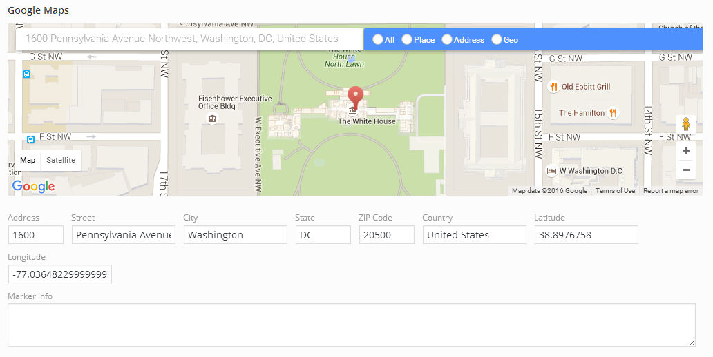

# Google Maps <Badge text="field" type="warn"/>

The Redux Google Map extension offers users the ability to search for map locations via the Redux options panel using the Google Maps API.  Such an extension comes in very handy when outputting maps and markers on the front-end of theme pages, using latitude/longitude return values with the Google Maps API.

<span style="display:block;text-align:center"></span>

::: warning Table of Contents
[[toc]]
:::

::: tip Getting Started
To understand how to use extensions, you should read this article on [Using Extensions](../guides/basics/using-extensions.md).
 To shortcut the process, you can use the [Redux Build](http://build.redux.io/) site. Please be aware that a working 
 knowledge of PHP and CSS is required to properly use this extension. Should you not be familiar with one or the other 
 (or both), please refer to the following guides to get you started: 
 [Getting Started with PHP](http://www.php.net/manual/en/tutorial.php), 
 [CSS Introduction](http://www.w3schools.com/css/css_intro.asp).
:::

::: danger DISCLAIMER
This extension does not - repeat - does **NOT** output any type of Google map through usage in front-end theme code.  
It simply takes the location the user chooses within the map interface and saves the address components, latitude, 
longitude, and marker information to the database (see Example Usage below).  You - the developer - may then use this 
information to generate and display maps via the Google Maps API using shortcodes, or any other means appropriate to 
your theme.
:::

## Getting Started
To understand how to use extensions, you should read this article on [Using Extensions](../guides/basics/using-extensions.md). 
To shortcut the process, you could use the [Redux Builder](https://build.redux.io). Please be aware that a working 
knowledge of PHP and CSS is required to properly use this field. Should you not be familiar with one or the other 
(or both), please refer to the following guides to get you started: [Getting Started with PHP](http://www.php.net/manual/en/tutorial.php), 
[CSS Introduction](http://www.w3schools.com/css/css_intro.asp).

## Arguments
|Name|Type|Default|Description|
|--- |--- |--- |--- |
|type|string|`google_maps`|Value identifying the field type.|
|id|string|Unique ID identifying the field. Must be different from all other field IDs.|
|title|string|Displays title of the field.|
|subtitle|string|Subtitle display of the field, situated beneath the title.|
|desc|string|Description of the field, appearing beneath the field control.|
|class|string|Appends any number of classes to the field's class attribute.|
|full_width|bool|`false`|Flag to set the field full width or tabled.|
|placeholder|string|"Enter your address"|Text to appear in the search box when no data is present.|
|marker_tooltip|string|"Left mouse down on top of me to move me!"|Set's the tooltip text that appears when hovering over the place marker.|
|no_geometry_alert|string|"The returned place contains no geometric data."|Set's the message to appear via JavaScript alert when the selected place contains no geometric data.|
|map_height|string|250px|Adjust the height of the map on screen.  Please include the unit type with your settings (px, em, %, etc).|
|show_api_key|bool|`true`|Displays a button beneath the map where clients may enter their own Google Maps API key data.  See Google Maps API Key below.|
|scroll_wheel|bool|`false`|Sets the flag which allows or prevents map zooming when using the mouse wheel.|
|street_view_control|bool|`true`|Sets the flag to display or hide the street view control.|
|map_type_control|bool|`true`|Sets the flag to display or hide the map type (satellite) control.|
|show_controls|bool|`true`|Flag to set the autocomplete control bat the the top of the map.|
|show_address|bool|`true`|Flag to display or hide the street name and number text boxes.|
|show_city|bool|`true`|Flag to display or hide the city text box.|
|show_state|bool|`true`|Flag to display or hide the state text box.|
|show_postal|bool|`true`|Flag to display or hide the zip/post code text box.|
|show_country|bool|`true`|Flag to display or hide the country text box.|
|show_latitude|bool|`true`|Flag to display or hide the latitude text box.|
|show_longitude|bool|`true`|Flag to display or hide the longitude text box.|
|show_marker_info|bool|`true`|Flag to display or hide the marker info text box.|
|default|array|Array of values specifying the default values of the map.  See Google Map Default Values below.|
|compiler|bool|Flag to run the compiler hook.  More info|
|required|array|Provide the parent, comparison operator, and value which affects the field's visibility.  More info|
|hint|array|Array containing the `content` and optional `title` arguments for the hint tooltip. More info|
|api_key|string|(Optional) String value of the API key to use with Google Maps.|
|map_version|string|3.exp|Google Map API version number.|

::: tip Also See
- [Using the `compiler` Argument](../configuration/fields/compiler.md)
- [Using the `hints` Argument](../configuration/fields/hints.md)
- [Using the `permissions` Argument](../configuration/fields/permissions.md)
- [Using the `required` Argument](../configuration/fields/required.md)
:::

## Google Map Default Values
For this extension, default values are optional.  Leaving them blank (or not settings them at all) will default the Google Map to the United States of America.
|Name|Type|Default|Description|
|--- |--- |--- |--- |
|street_number|string|The address street number|
|route|string|The name of the road, street, lane, etc.|
|locality|string|The name of the town or city.|
|administrative_area_level_1|string|The name of the state, union, territory, etc.|
|postal_code|string|The number of the ZIP or postal code.|
|country|string|The name of the country.|
|latitude|string/float|The float (decimal) value representing the latitude value.|
|longitude|string/float|The float (decimal) value representing the longitude value.|
|marker_info|string|Text to appear over the map marker when the map marker is clicked.|
|zoom|string/int|3 - when using lat/lng<br /><br />17 - when using addresses.|The amount of zoom in which to set the map.|

## Google Maps API Key
The Redux Google Maps extension does not contain an API Key.  This constitutes the standard usage limit for the Google Maps API, which is free until exceeding 25,000 map loads per 24 hours for 90 consecutive days.  In most normal situations, since these maps are only loaded on displayed in your options panel, to break such a limit would be unusual.  However, since nothing is impossible, if this limit should be reached, it may become necessary to obtain a Google Maps API Key.  It is not your responsibility as a theme developer to provide one with your theme.  We've included a Google Maps API Key feature in the extension where your users are given this information with links to obtain their own unique key for high usage.  While we've provided very general information about this via our interface, it's recommended you include this information in your theme documentation so your users are aware of such limitations and if necessary, how to deal with them.

If your theme uses the rendering of Google Maps on the front end via a shortcode or Visual Composer and have chosen to include a Google Maps API Key with your theme, you may set this key via the `api_key` argument as described in the Advanced Arguments section above.

For more information about Google Maps API Usage guidelines, please visit <a href="https://developers.google.com/maps/documentation/javascript/usage" target="_blank">https://developers.google.com/maps/documentation/javascript/usage</a>

For more information on obtaining a Google Maps API Key, please visit: <a href="https://developers.google.com/maps/documentation/javascript/get-api-key" target="_blank">https://developers.google.com/maps/documentation/javascript/get-api-key</a>

## Example Config
Under normal circumstances, it probably will not be necessary to set any default values, as your users will ultimate want to set their own via the map interface.  However, if you have a reason to set to defaults, please take note of the following limitations:

<strong>NOTE</strong>:  The Google Fonts extension will always use the latitude and longitude settings first, so set a map.  It will ignore address settings.  Both `latitude `and `longitude `arguments must be set.  It cannot be one or the other, otherwise Google Map will display wither the address information (if any is set) or display the default full map of America.

<strong>NOTE</strong>:  If setting only the `latitude `and `longitude `arguments, no address data will be displayed or generated.  Alternatively, if address information is set, Google Maps will return the closest latitude/longitude coordinates.

```php
array(
    'id'        => 'opt-google-maps',
    'type'      => 'google_maps',
    'title'     => 'Google Maps',
    'subtitle'  => 'Select a location from the map below.',
    'full_width'=> true,
    'default'   => array (
        // It's not necessary to fill out *every* default value for any 
        // given location.  We are doing so here for sample purposes.
        'street_number' => '1600',
        'route'         => 'Pennsylvania Avenue Northwest',
        'locality'      => 'Washington',
        'administrative_area_level_1' => 'DC',
        'postal_code'   => '20500',
        'country'       => 'United States',
        'latitude'      => '38.8976758',
        'longitude'     => '-77.03648229999999',
        'marker_info'   => 'Home of the President of the United States.',
    )
),
```

## Example Usage
The extension's return value is an array of the default values above and their values. The default values returned will remain unchanged if the user does not change the map's location. When they do, the new location information will be output. (Please remember to replace `redux_demo` with your own `<a title="opt_name" href="/redux-framework/arguments/opt_name">opt_name</a>` argument).

```php
global $redux_demo;

echo $redux_demo['opt-google-maps']['street_number'];
echo $redux_demo['opt-google-maps']['route'];
echo $redux_demo['opt-google-maps']['locality'];
echo $redux_demo['opt-google-maps']['administrative_area_level_1'];
echo $redux_demo['opt-google-maps']['postal_code'];
echo $redux_demo['opt-google-maps']['country'];
echo $redux_demo['opt-google-maps']['latitude'];
echo $redux_demo['opt-google-maps']['longitude'];
echo $redux_demo['opt-google-maps']['marker_info'];
```
